# Modelo de datos — MVP-1A a `0.6.0` / MVP-1C

Fuente de verdad: `prisma/schema.prisma` y las migraciones
`prisma/migrations/20260910133815_init/migration.sql` (MVP-1A),
`prisma/migrations/20260910202939_add_kpi_configuration/migration.sql`
(MVP-1B),
`prisma/migrations/20260911082446_add_productivity_import/migration.sql`
(IMPORT-1A / MVP-1C.1),
`prisma/migrations/20260911100002_add_escalations_quality_voice_import/migration.sql`
(MVP-1C.2 / IMPORT-1B),
`prisma/migrations/20260911111623_add_manual_kpi_entries/migration.sql`
(MVP-1C.3 / INPUT-1C),
`prisma/migrations/20260911140000_add_position_points/migration.sql`
(`BUGFIX-1 / UX-SPLIT-1`),
`prisma/migrations/20260911154959_add_results_publication_and_auth/migration.sql`,
`prisma/migrations/20260911155500_add_publication_check_constraints/migration.sql`
(`0.6.0` / MVP-1C) y
`prisma/migrations/20260911205212_add_factions/migration.sql`
(`0.7.0` / MVP-2A). Este documento describe y explica ese esquema; en caso
de discrepancia, el esquema real manda.

## Diagrama entidad-relacion

```mermaid
erDiagram
    Person ||--o{ SplitParticipant : "participa como"
    Split ||--o{ SplitWeek : "tiene"
    Split ||--o{ SplitParticipant : "tiene"
    Split ||--o{ SplitKpiConfig : "configura"
    Split ||--o{ SplitPositionPointRule : "configura"
    Split ||--o{ SplitFaction : "tiene"
    SplitFaction ||--o{ SplitParticipant : "agrupa"
    SplitFaction ||--o{ PublishedParticipantWeeklyResult : "tiene resultado en (snapshot)"
    SplitWeek ||--o{ SplitParticipant : "es semana inicial de"
    SplitWeek ||--o| ProductivityImport : "tiene carga vigente"
    ProductivityImport ||--o{ ProductivityWeeklyRow : "contiene"
    SplitParticipant ||--o{ ProductivityWeeklyRow : "tiene fila en"
    SplitWeek ||--o| EscalationImport : "tiene carga vigente"
    EscalationImport ||--o{ EscalationWeeklyRow : "contiene"
    SplitParticipant ||--o{ EscalationWeeklyRow : "tiene fila en"
    SplitWeek ||--o| QualityImport : "tiene carga vigente"
    QualityImport ||--o{ QualityWeeklyRow : "contiene"
    SplitParticipant ||--o{ QualityWeeklyRow : "tiene fila en"
    SplitWeek ||--o| VoiceImport : "tiene carga vigente"
    VoiceImport ||--o{ VoiceWeeklyRow : "contiene"
    SplitParticipant ||--o{ VoiceWeeklyRow : "tiene fila en"
    SplitWeek ||--o{ StabilityWeeklyEntry : "tiene entrada"
    SplitParticipant ||--o{ StabilityWeeklyEntry : "tiene fila en"
    SplitWeek ||--o{ ChronomancyWeeklyEntry : "tiene entrada"
    SplitParticipant ||--o{ ChronomancyWeeklyEntry : "tiene fila en"
    SplitWeek ||--o{ WriterWeeklyEntry : "tiene entrada"
    SplitParticipant ||--o{ WriterWeeklyEntry : "tiene fila en"
    SplitWeek ||--o{ StudentWeeklyEntry : "tiene entrada"
    SplitParticipant ||--o{ StudentWeeklyEntry : "tiene fila en"
    SplitWeek ||--o{ ApprenticeWeeklyEntry : "tiene entrada"
    SplitParticipant ||--o{ ApprenticeWeeklyEntry : "tiene fila en"
    Person ||--o| User : "tiene cuenta"
    SplitWeek ||--o| WeekPublication : "tiene publicacion"
    User ||--o{ WeekPublication : "publica"
    WeekPublication ||--o{ PublishedParticipantWeeklyResult : "contiene"
    Split ||--o{ PublishedParticipantWeeklyResult : "contiene (desnormalizado)"
    SplitParticipant ||--o{ PublishedParticipantWeeklyResult : "tiene resultado en"
    Person ||--o{ PublishedParticipantWeeklyResult : "tiene resultado en"
    PublishedParticipantWeeklyResult ||--o{ PublishedKpiResult : "contiene"

    User {
        string id PK
        string email "unico, normalizado"
        string passwordHash "bcrypt, nunca en claro"
        enum role "ADMIN, PARTICIPANT"
        string personId FK "opcional, unico"
        boolean isActive
        boolean mustChangePassword
        datetime createdAt
        datetime updatedAt
    }

    WeekPublication {
        string id PK
        string splitWeekId FK "unico: una publicacion por semana"
        datetime publishedAt
        string publishedByUserId FK "opcional"
        datetime createdAt
    }

    PublishedParticipantWeeklyResult {
        string id PK
        string publicationId FK
        string splitId FK "desnormalizado, para consultas por split"
        string splitParticipantId FK
        string personId FK
        string fullNameSnapshot
        string aliasSnapshot
        enum levelSnapshot "N0, N1, N2"
        decimal totalKpiPoints "puede ser negativo"
        decimal applicableMaxPoints "opcional"
        int weeklyRank "mayor o igual que 1"
        int positionPoints "no negativo"
        int rankedParticipantCount "mayor o igual que 1"
        string factionId FK "opcional; null si el split no usa facciones o es anterior a 0.7.0"
        string factionNameSnapshot "opcional, congelado al publicar"
        string factionColorSnapshot "opcional, congelado al publicar"
        datetime createdAt
    }

    PublishedKpiResult {
        string id PK
        string participantWeeklyResultId FK
        enum kpiCode "catalogo cerrado"
        string kpiNameSnapshot
        enum outcomeStatus "COMPUTED, VAC, NOT_APPLICABLE"
        decimal rawPoints "opcional"
        decimal finalPoints "opcional, puede ser negativo"
        decimal baseMax "opcional, mayor que cero"
        boolean capped
        int kpiRank "opcional, mayor o igual que 1"
        int rankedParticipantCount "opcional"
        datetime createdAt
    }

    Person {
        string id PK
        string fullName
        string email "opcional, unico, normalizado"
        datetime createdAt
        datetime updatedAt
    }

    Split {
        string id PK
        string name
        string description "opcional"
        date startDate "siempre lunes"
        int numberOfWeeks "1 a 52"
        enum status "DRAFT, ACTIVE, CLOSED"
        datetime createdAt
        datetime updatedAt
    }

    SplitWeek {
        string id PK
        string splitId FK
        int sequenceNumber "identidad: splitId + sequenceNumber"
        date startDate "lunes"
        date endDate "domingo"
        datetime createdAt
        datetime updatedAt
    }

    SplitParticipant {
        string id PK
        string splitId FK
        string personId FK
        string alias
        string aliasNormalized "minusculas, sin espacios exteriores"
        enum level "N0, N1, N2"
        int startWeekSequenceNumber "FK compuesta a SplitWeek"
        int endWeekSequenceNumber "opcional, sin usar todavia"
        string factionId FK "opcional, ver SplitFaction"
        datetime createdAt
        datetime updatedAt
    }

    SplitFaction {
        string id PK
        string splitId FK
        string name
        string nameNormalized "minusculas, sin espacios exteriores; unico por split"
        string color "hexadecimal #RRGGBB"
        datetime createdAt
        datetime updatedAt
    }

    SplitKpiConfig {
        string id PK
        string splitId FK
        enum kpiCode "catalogo cerrado, ver KpiCode"
        boolean isActive "por defecto false"
        decimal baseMax "mayor que cero"
        decimal multiplierN0 "opcional: null = nivel no aplicable"
        decimal multiplierN1 "opcional: null = nivel no aplicable"
        decimal multiplierN2 "opcional: null = nivel no aplicable"
        json parameters "parametros propios del KPI, validados por esquema"
        datetime createdAt
        datetime updatedAt
    }

    ProductivityImport {
        string id PK
        string splitWeekId FK "unico: una carga vigente por semana"
        string originalFilename
        string fileSha256 "identifica el archivo, no deduce la semana"
        int sourceRowCount
        int importedRowCount
        datetime createdAt
        datetime updatedAt
    }

    ProductivityWeeklyRow {
        string id PK
        string productivityImportId FK
        string splitParticipantId FK "onDelete Restrict"
        string sourceAgentName "trazabilidad"
        int updates "conservado para Domador de Escaladas"
        int comments
        int publicComments
        int internalComments
        int ticketsUpdatedWithComment "entrada de Explorador de datos"
        int ticketsResolved "entrada de Cazador de soluciones"
        int ticketsCreated
        datetime createdAt
        datetime updatedAt
    }

    EscalationImport {
        string id PK
        string splitWeekId FK "unico: una carga vigente por semana"
        string originalFilename
        string fileSha256
        int sourceRowCount
        int importedRowCount
        datetime createdAt
        datetime updatedAt
    }

    EscalationWeeklyRow {
        string id PK
        string escalationImportId FK
        string splitParticipantId FK "onDelete Restrict"
        string sourceAgentName "trazabilidad"
        int groupReassignments "numerador de Domador de Escaladas"
        datetime createdAt
        datetime updatedAt
    }

    QualityImport {
        string id PK
        string splitWeekId FK "unico: una carga vigente por semana"
        string originalFilename
        string fileSha256
        int sourceRowCount
        int importedRowCount
        datetime createdAt
        datetime updatedAt
    }

    QualityWeeklyRow {
        string id PK
        string qualityImportId FK
        string splitParticipantId FK "onDelete Restrict"
        string sourceAgentName "trazabilidad"
        int goodSatisfactionTickets
        int badSatisfactionTickets
        datetime createdAt
        datetime updatedAt
    }

    VoiceImport {
        string id PK
        string splitWeekId FK "unico: una carga vigente por semana"
        string originalFilename
        string fileSha256
        int sourceRowCount
        int importedRowCount
        datetime createdAt
        datetime updatedAt
    }

    VoiceWeeklyRow {
        string id PK
        string voiceImportId FK
        string splitParticipantId FK "onDelete Restrict"
        string sourceAgentName "trazabilidad"
        int acceptedCallSegments
        int rejectedCallSegments
        int unattendedCallSegments
        int outboundCalls
        decimal segmentDurationHours "trazabilidad, no puntua"
        decimal segmentTalkTimeHours "trazabilidad, no puntua"
        decimal segmentWrapUpTimeHours "trazabilidad, no puntua"
        decimal segmentTalkTimeMinutes "trazabilidad, no puntua"
        decimal segmentWrapUpTimeMinutes "trazabilidad, no puntua"
        datetime createdAt
        datetime updatedAt
    }

    StabilityWeeklyEntry {
        string id PK
        string splitWeekId FK
        string splitParticipantId FK "onDelete Restrict"
        decimal resultValue "no negativo; 0 es un dato real"
        datetime createdAt
        datetime updatedAt
    }

    ChronomancyWeeklyEntry {
        string id PK
        string splitWeekId FK
        string splitParticipantId FK "onDelete Restrict"
        decimal productiveHours "no negativo"
        decimal totalHours "no negativo; 0 = VAC"
        datetime createdAt
        datetime updatedAt
    }

    WriterWeeklyEntry {
        string id PK
        string splitWeekId FK
        string splitParticipantId FK "onDelete Restrict"
        int deliveredArticles "no negativo"
        int undeliveredArticles "no negativo, conteo positivo"
        int proposedArticles "no negativo"
        datetime createdAt
        datetime updatedAt
    }

    StudentWeeklyEntry {
        string id PK
        string splitWeekId FK
        string splitParticipantId FK "onDelete Restrict"
        decimal dedicatedHours "no negativo"
        datetime createdAt
        datetime updatedAt
    }

    ApprenticeWeeklyEntry {
        string id PK
        string splitWeekId FK
        string splitParticipantId FK "onDelete Restrict"
        int completedTrainings "no negativo; maximo targetValue validado en servicio"
        datetime createdAt
        datetime updatedAt
    }

    SplitPositionPointRule {
        string id PK
        string splitId FK
        int position "1 a 15"
        int points "no negativo"
        datetime createdAt
        datetime updatedAt
    }
```

## Tablas, campos y relaciones

### `Person`

Registro global y estable, reutilizable entre splits.

- `id`: UUID, clave primaria.
- `fullName`: nombre completo, obligatorio.
- `email`: opcional. Se normaliza (recortado y en minusculas) antes de
  guardarse, y tiene un indice unico (`Person_email_key`). Preparado para
  identificar en el futuro la cuenta del participante.
- `createdAt`, `updatedAt`: gestionados automaticamente.
- No existe borrado fisico en esta entrega. No se ha disenado todavia
  ninguna regla de baja o desactivacion: se ha pospuesto deliberadamente
  (ver `docs/DECISIONS.md`).

### `Split`

Una edicion de la gamificacion.

- `id`: UUID, clave primaria.
- `name`, `description` (opcional).
- `startDate`: columna `DATE` (sin hora). Restriccion de base de datos
  `Split_startDate_is_monday_check` que exige que sea lunes
  (`EXTRACT(ISODOW FROM "startDate") = 1`).
- `numberOfWeeks`: entero. Restriccion de base de datos
  `Split_numberOfWeeks_range_check` que exige un valor entre 1 y 52.
- `status`: enum `SplitStatus` (`DRAFT`, `ACTIVE`, `CLOSED`). Se crea
  siempre en `DRAFT`. El cierre funcional (`CLOSED`) no se implementa
  todavia; el estado queda preparado en el modelo.

### `SplitWeek`

Las semanas generadas de un split.

- `id`: UUID, clave primaria.
- `splitId`: referencia a `Split` (borrado en cascada si se borra el
  split).
- `sequenceNumber`: numero secuencial dentro del split (1, 2, 3...). Es la
  identidad funcional de la semana junto con `splitId`; el numero ISO del
  calendario no se guarda ni se usa como identidad.
- `startDate` / `endDate`: columnas `DATE`. Restricciones de base de datos
  que exigen que `startDate` sea lunes y `endDate` sea domingo.
- Indice unico `SplitWeek_splitId_sequenceNumber_key` sobre
  (`splitId`, `sequenceNumber`).

### `SplitParticipant`

La relacion entre una persona y un split, con sus datos propios de esa
participacion.

- `id`: UUID, clave primaria.
- `splitId`, `personId`: referencias a `Split` y `Person`.
- `alias`: tal como lo escribe el administrador.
- `aliasNormalized`: version normalizada (recortada y en minusculas),
  usada exclusivamente para garantizar la unicidad dentro del split.
  Restriccion de base de datos que impide que quede vacia.
- `level`: enum `ParticipantLevel` (`N0`, `N1`, `N2`).
- `startWeekSequenceNumber`: semana desde la que participa. Es una clave
  foranea **compuesta** hacia `SplitWeek` (`splitId` +
  `sequenceNumber`), lo que garantiza a nivel de base de datos que la
  semana inicial pertenece al mismo split.
- `endWeekSequenceNumber`: opcional, sin uso todavia. Preparado para un
  futuro cierre de participacion; cuando se use, debera referenciar una
  semana del mismo split (regla a aplicar en su momento, no forzada aun
  por una restriccion de base de datos).
- Indice unico `SplitParticipant_splitId_personId_key`: una persona solo
  puede aparecer una vez en un mismo split.
- Indice unico `SplitParticipant_splitId_aliasNormalized_key`: el alias
  normalizado es unico dentro del split (el mismo alias si puede
  repetirse en splits distintos).
- `factionId` (`0.7.0` / MVP-2A, ver `docs/FACTIONS.md`): referencia
  opcional a `SplitFaction` con `onDelete: Restrict` (una faccion con
  participantes asignados nunca se borra fisicamente). Nullable para
  migrar de forma segura splits existentes y splits que no usan facciones;
  los servicios exigen una asignacion completa antes de activar o publicar
  un split que ya tiene alguna faccion creada. Indice `SplitParticipant_factionId_idx`.

### `SplitFaction` (`0.7.0` / MVP-2A)

Faccion de un split (ver `docs/FACTIONS.md`).

- `id`: UUID, clave primaria.
- `splitId`: referencia a `Split` (borrado en cascada si se borra el
  split).
- `name`, `nameNormalized` (minusculas, sin espacios exteriores, con
  restriccion de base de datos que impide que quede vacio). Indice unico
  `SplitFaction_splitId_nameNormalized_key`: unico dentro del split, puede
  repetirse en otro split.
- `color`: hexadecimal `#RRGGBB`, validado en servicio y con la
  restriccion de base de datos `SplitFaction_color_format_check`. Solo es
  una ayuda visual, no necesita ser unico.
- No se borra fisicamente una faccion referenciada por
  `SplitParticipant.factionId` (`onDelete: Restrict`) ni por
  `PublishedParticipantWeeklyResult.factionId`: el servicio comprueba
  ademas explicitamente que no tenga participantes asignados ni el split
  publicaciones antes de permitir eliminarla.

### `SplitKpiConfig`

Configuracion de un KPI del catalogo cerrado (enum `KpiCode`, ver
`src/domain/kpis/catalog.ts` y `docs/KPI_CONFIGURATION.md`) para un split
concreto. Cada split conserva su propia copia editable, independiente de
los valores predeterminados del catalogo y de la configuracion de otros
splits.

- `id`: UUID, clave primaria.
- `splitId`: referencia a `Split` (borrado en cascada si se borra el
  split).
- `kpiCode`: enum `KpiCode` con los diez codigos del catalogo cerrado. El
  orden de declaracion del enum coincide con el orden de presentacion del
  catalogo (PostgreSQL ordena los enums por orden de declaracion, no
  alfabeticamente).
- `isActive`: si el KPI esta activo en este split. `false` por defecto.
- `baseMax`: `Decimal(12,4)` (nunca `Float`, para no perder precision en
  comparaciones). Restriccion de base de datos que exige que sea mayor que
  cero.
- `multiplierN0` / `multiplierN1` / `multiplierN2`: `Decimal(12,4)`
  opcionales. Restriccion de base de datos que exige, cuando existen, que
  sean mayores o iguales que cero. Un valor `NULL` significa que ese nivel
  **no es aplicable** a ese KPI, no que el multiplicador sea cero.
- Restriccion de base de datos adicional: si `isActive` es `true`, al
  menos uno de los tres multiplicadores debe estar informado.
- `parameters`: `Json` (`jsonb`) con los parametros propios del tipo de
  calculo de ese KPI (ver `docs/KPI_CONFIGURATION.md`). Nunca se acepta tal
  cual desde el navegador: la accion de servidor construye este objeto a
  partir de los campos que el catalogo declara para ese `kpiCode`, y el
  esquema de validacion de ese KPI concreto lo valida antes de guardarse.
- Indice unico `SplitKpiConfig_splitId_kpiCode_key`: un split tiene como
  mucho una configuracion por cada KPI del catalogo (en la practica,
  siempre las diez).

### `ProductivityImport`

Cabecera de la carga semanal del Excel de Productividad para una semana de
un split (ver `docs/IMPORT_PRODUCTIVITY.md`). Un unico archivo alimenta
`SOLUTION_HUNTER` y `DATA_EXPLORER`.

- `id`: UUID, clave primaria.
- `splitWeekId`: referencia a `SplitWeek` (borrado en cascada si se borra
  la semana). Indice unico: como mucho una carga **vigente** por semana.
- `originalFilename`: nombre del archivo tal como se subio, solo para
  mostrarlo en pantalla; nunca se guarda el binario.
- `fileSha256`: hash del contenido procesado. Identifica el archivo para
  depuracion administrativa; no se usa para deducir la semana ni ninguna
  otra logica de negocio.
- `sourceRowCount` / `importedRowCount`: total de filas de datos leidas y
  numero de filas realmente persistidas (solo las "encontradas"). Ambas
  con restriccion de base de datos que exige un valor no negativo.

### `ProductivityWeeklyRow`

Una fila por participante encontrado dentro de una carga.

- `id`: UUID, clave primaria.
- `productivityImportId`: referencia a `ProductivityImport` (borrado en
  cascada si se borra la carga, por ejemplo al sustituirla).
- `splitParticipantId`: referencia a `SplitParticipant` con
  `onDelete: Restrict`, a proposito: una fila de productividad nunca debe
  desaparecer por borrar accidentalmente al participante.
- `sourceAgentName`: nombre tal como aparecia en la columna "Nombre del
  actualizador", conservado para trazabilidad (la identidad real es
  `Person.fullName`, pero se guarda el texto de origen).
- Los siete conteos (`updates`, `comments`, `publicComments`,
  `internalComments`, `ticketsUpdatedWithComment`, `ticketsResolved`,
  `ticketsCreated`) son `Int`, todos con restriccion de base de datos que
  exige un valor no negativo. `updates` se conserva para el futuro calculo
  de Domador de Escaladas (`ESCALATION_TAMER`); no se usa todavia.
- Indice unico `ProductivityWeeklyRow_productivityImportId_splitParticipant_key`
  (`productivityImportId` + `splitParticipantId`): una carga solo puede
  tener una fila por participante.
- Los puntos de Cazador de soluciones y Explorador de datos **no** se
  guardan aqui: se calculan al consultar, a partir de estos conteos, el
  nivel del participante y `SplitKpiConfig` (ver
  `docs/IMPORT_PRODUCTIVITY.md` y `docs/DECISIONS.md`).

### `EscalationImport` y `EscalationWeeklyRow`

Misma forma que `ProductivityImport`/`ProductivityWeeklyRow` (ver
`docs/IMPORT_ESCALATIONS_QUALITY_VOICE.md`), para la carga semanal del
Excel de Escalados. `EscalationWeeklyRow.groupReassignments` (`Int`, no
negativo) es el numerador de Domador de Escaladas (`ESCALATION_TAMER`); el
denominador (`ProductivityWeeklyRow.updates`) no se duplica aqui, se lee de
Productividad de la misma semana y participante al calcular. Igual que
Productividad: `splitWeekId` unico en la cabecera, `onDelete: Restrict`
desde la fila hacia el participante, y una fila como maximo por
participante dentro de una carga (`@@unique([escalationImportId, splitParticipantId])`).

### `QualityImport` y `QualityWeeklyRow`

Misma forma, para la carga semanal del Excel de Calidad.
`QualityWeeklyRow.goodSatisfactionTickets` y `badSatisfactionTickets`
(`Int`, no negativos) alimentan Maestro Artesano (`MASTER_CRAFTSMAN`).

### `VoiceImport` y `VoiceWeeklyRow`

Misma forma, para la carga semanal del Excel de Llamadas.
`VoiceWeeklyRow` guarda cuatro conteos (`Int`, no negativos:
`acceptedCallSegments`, `rejectedCallSegments`, `unattendedCallSegments`,
`outboundCalls`) que alimentan Embajador de voz (`VOICE_AMBASSADOR`), mas
cinco metricas de tiempo (`Decimal(14,6)`, no negativas: `segmentDurationHours`, `segmentTalkTimeHours`,
`segmentWrapUpTimeHours`, `segmentTalkTimeMinutes`,
`segmentWrapUpTimeMinutes`) conservadas solo para trazabilidad, sin
intervenir en el calculo.

Los puntos de los tres KPI, igual que Productividad, **no** se guardan:
se calculan al consultar a partir de estos conteos, el nivel del
participante y `SplitKpiConfig`.

### Las cinco entradas manuales (`MVP-1C.3 / INPUT-1C`)

Sin fichero, cabecera de carga, hash ni nombre de origen: una fila semanal
tipada por participante, guardada directamente por el administrador (ver
`docs/MANUAL_KPI_ENTRY.md`). Las cinco comparten la misma forma: `id`
(UUID), `splitWeekId` (`onDelete: Cascade` desde `SplitWeek`),
`splitParticipantId` (`onDelete: Restrict` desde `SplitParticipant`, igual
que las filas de importacion), timestamps, restriccion unica
`[splitWeekId, splitParticipantId]` (una fila por participante y semana) y
restricciones SQL de no negatividad. Ninguna guarda puntos, porcentajes,
estados, `VAC`, maximos ni contadores derivados: todo se calcula al
consultar.

- **`StabilityWeeklyEntry`**: `resultValue` (`Decimal(12,4)`, no negativo).
  Alimenta Guardian de la Estabilidad (`STABILITY_GUARDIAN`).
- **`ChronomancyWeeklyEntry`**: `productiveHours` y `totalHours`
  (`Decimal(12,4)`, no negativos). Alimenta Cronomagia laboral
  (`WORK_CHRONOMANCY`). No tiene columna `occupancy`: se calcula al
  consultar.
- **`WriterWeeklyEntry`**: `deliveredArticles`, `undeliveredArticles`,
  `proposedArticles` (`Int`, no negativos). Alimenta Redactor estrella
  (`STAR_WRITER`).
- **`StudentWeeklyEntry`**: `dedicatedHours` (`Decimal(12,4)`, no
  negativo). Alimenta Estudiante entusiasta (`ENTHUSIASTIC_STUDENT`).
- **`ApprenticeWeeklyEntry`**: `completedTrainings` (`Int`, no negativo).
  Alimenta Aprendiz experto (`EXPERT_APPRENTICE`). El maximo
  (`targetValue` de `SplitKpiConfig`) se valida en el servicio, no en la
  base de datos: un cambio posterior de `targetValue` no modifica ni
  recorta silenciosamente los valores ya guardados.

Migracion `add_manual_kpi_entries`, compatible con los datos existentes de
`0.4.0`.

### `SplitPositionPointRule` (`BUGFIX-1 / UX-SPLIT-1`)

Puntos por posicion semanal de un split (ver
`docs/POSITION_POINTS_CONFIGURATION.md`). No es un KPI ni se relaciona con
`SplitKpiConfig`: es una configuracion aparte que todavia no se aplica a
ningun resultado.

- `id`: UUID, clave primaria.
- `splitId`: referencia a `Split` (borrado en cascada si se borra el
  split).
- `position`: entero. Restriccion de base de datos
  `SplitPositionPointRule_position_range_check` que exige `1 <= position
  <= 15`: en esta primera version existen exactamente esas quince
  posiciones, sin filas dinamicas.
- `points`: entero. Restriccion de base de datos
  `SplitPositionPointRule_points_nonnegative_check` que exige un valor no
  negativo.
- Indice unico `SplitPositionPointRule_splitId_position_key`
  (`splitId` + `position`).

Cada split conserva su propia copia (igual que `SplitKpiConfig`): editar
los puntos de un split no modifica los de otro. Migracion
`add_position_points`, con backfill de los quince valores exactos de
Split 8 para cada split existente y creacion automatica de las quince
reglas al crear un split nuevo, dentro de la misma transaccion que crea el
split, sus semanas y su configuracion de KPI.

### `User` (`0.6.0` / MVP-1C)

Cuenta de acceso local (ver `docs/AUTHENTICATION.md`).

- `id`: UUID, clave primaria.
- `email`: normalizado, unico (`User_email_key`).
- `passwordHash`: hash `bcrypt`; nunca se guarda la contrasena en claro ni
  con cifrado reversible.
- `role`: enum `UserRole` (`ADMIN`, `PARTICIPANT`).
- `personId`: referencia opcional y **unica** a `Person`
  (`User_personId_key`), `onDelete: Restrict`. Un `PARTICIPANT` debe
  quedar vinculado uno a uno con una persona; un `ADMIN` puede no estarlo.
- `isActive`: si la cuenta puede iniciar sesion.
- `mustChangePassword`: obliga a cambiar la contrasena en el proximo
  acceso (activado al crear la cuenta o al restablecer la contrasena
  temporal).

### `WeekPublication` (`0.6.0` / MVP-1C)

Publicacion de una semana: operacion de dominio irreversible que crea una
instantanea inmutable y bloquea cualquier modificacion posterior de las
entradas de esa semana (ver `docs/RESULTS_PUBLICATION.md`).

- `id`: UUID, clave primaria.
- `splitWeekId`: referencia unica a `SplitWeek` (`onDelete: Restrict`): como
  mucho una publicacion por semana.
- `publishedAt`: fecha/hora de la publicacion.
- `publishedByUserId`: referencia opcional a `User` (`onDelete: SetNull`),
  para conservar el historial de quien publico cuando sea posible.

`WeekPublication` es la unica fuente de verdad de que una semana esta
publicada: no se mezcla con `SplitStatus.CLOSED`, que sigue cerrando el
split completo. No existe "despublicar" ni "reabrir" en esta entrega.

### `PublishedParticipantWeeklyResult` y `PublishedKpiResult` (`0.6.0` / MVP-1C)

Instantanea congelada de un participante en una semana publicada: nombre,
alias, nivel, totales, ranking, puntos por posicion y el detalle de cada
KPI, tal como eran en el momento de publicar. Un cambio posterior en
`SplitParticipant`, `Person`, `SplitKpiConfig` o `SplitPositionPointRule`
nunca modifica estas filas.

- `PublishedParticipantWeeklyResult.splitId` esta **desnormalizado** desde
  `splitParticipant`/`publication.splitWeek.split` para poder consultar la
  clasificacion de un split completo indexando directamente por `splitId`
  (`PublishedParticipantWeeklyResult_splitId_idx`), sin recorrer esa
  cadena de relaciones por cada fila (ver `docs/DECISIONS.md`).
- `totalKpiPoints` y `PublishedKpiResult.finalPoints`/`rawPoints` son
  `Decimal` y **pueden ser negativos** (sin restriccion de base de datos
  en ese sentido); `weeklyRank`, `positionPoints`, `rankedParticipantCount`
  y `kpiRank` tienen restricciones de no negatividad/minimo `1` donde
  corresponde (`add_publication_check_constraints`).
- `PublishedKpiResult.outcomeStatus`: enum `PublishedKpiOutcomeStatus`
  (`COMPUTED`, `VAC`, `NOT_APPLICABLE`).
- Indices unicos: un solo resultado por participante y publicacion
  (`@@unique([publicationId, splitParticipantId])`) y un solo resultado por
  KPI y participante publicado (`@@unique([participantWeeklyResultId,
  kpiCode])`).
- `onDelete: Cascade` desde `WeekPublication` hacia
  `PublishedParticipantWeeklyResult`, y desde ahi hacia
  `PublishedKpiResult`; `onDelete: Restrict` hacia `Split`,
  `SplitParticipant`, `Person` y `SplitFaction` (una fila publicada nunca
  desaparece por borrar accidentalmente la entidad viva a la que hace
  referencia).
- `factionId`, `factionNameSnapshot`, `factionColorSnapshot` (`0.7.0` /
  MVP-2A, ver `docs/FACTIONS.md`): faccion del participante congelada en
  el momento de publicar. Los tres son opcionales: `null` cuando el split
  no usa facciones, o en publicaciones anteriores a esta version (nunca se
  completan retroactivamente). Indice `PublishedParticipantWeeklyResult_factionId_idx`.
  No existe un "renombre" ni un total de faccion persistido: la
  clasificacion de facciones se calcula siempre al consultar a partir de
  estos snapshots y de `positionPoints` (`faction-classification.service.ts`).

## Decisiones sobre fechas

- Todas las fechas de negocio (`Split.startDate`, `SplitWeek.startDate`,
  `SplitWeek.endDate`) se guardan como columnas `DATE` de PostgreSQL, sin
  componente horario.
- En el codigo de la aplicacion (`src/lib/dates.ts`) estas fechas se
  representan siempre como `Date` de JavaScript a medianoche **UTC**, y se
  parsean/formatean explicitamente como fechas de calendario
  (`AAAA-MM-DD`). Esto evita el error tipico de que un lunes se convierta
  en domingo (o viceversa) por la zona horaria del proceso.
- La generacion de semanas (`generateSplitWeeks`) es una funcion pura que
  no depende de la hora actual ni de la zona horaria del servidor.

## Backfill de splits existentes (`MVP-1B`)

La migracion `add_kpi_configuration` crea, ademas del enum y la tabla, una
sentencia `INSERT ... SELECT` que genera las diez `SplitKpiConfig` (una
por `KpiCode`, inactivas, con los valores predeterminados de Split 8) para
cada `Split` que ya existiera antes de aplicar la migracion. Sobre una
base de datos vacia esa sentencia no inserta ninguna fila. No modifica
`Person`, `SplitWeek` ni `SplitParticipant` existentes, ni cambia el
`status` de ningun split: un split `ACTIVE` que ya existiera quedara con
sus diez KPI inactivos hasta que el administrador los configure (ver
`docs/DECISIONS.md`).

## Entidades pospuestas

Estas entidades aparecen en el contexto funcional del producto pero
**no** se han creado todavia. Se documentan para que una futura entrega no
tenga que redescubrirlas:

- Despublicar/reabrir una semana ya publicada, o cierre irreversible de un
  split completo (`SplitStatus.CLOSED` ya existe, pero no se activa
  automaticamente).
- Profesiones, localizaciones, objetos y economia de creditos. Las
  facciones se implementaron en `0.7.0` / MVP-2A (`SplitFaction`, ver
  `docs/FACTIONS.md`); "renombre" no es una entidad propia, es
  `positionPoints` ya existente.

Con `0.6.0` / MVP-1C, ademas de los diez origenes de datos de KPI
(`ProductivityImport`/`ProductivityWeeklyRow`,
`EscalationImport`/`EscalationWeeklyRow`, `QualityImport`/`QualityWeeklyRow`,
`VoiceImport`/`VoiceWeeklyRow` y las cinco entradas manuales), el modelo
incluye autenticacion (`User`) y el ciclo completo de resultados
(`WeekPublication`, `PublishedParticipantWeeklyResult`,
`PublishedKpiResult`). La clasificacion general y la vista individual se
calculan en servicio a partir de estas tablas publicadas, sin tablas
propias adicionales (ver `docs/RESULTS_PUBLICATION.md`).

Con `0.7.0` / MVP-2A se anade `SplitFaction` y su relacion opcional desde
`SplitParticipant` y desde `PublishedParticipantWeeklyResult` (snapshot).
La clasificacion de facciones tampoco anade tablas propias: se calcula en
servicio a partir de estos snapshots y de `positionPoints` (ver
`docs/FACTIONS.md`).
