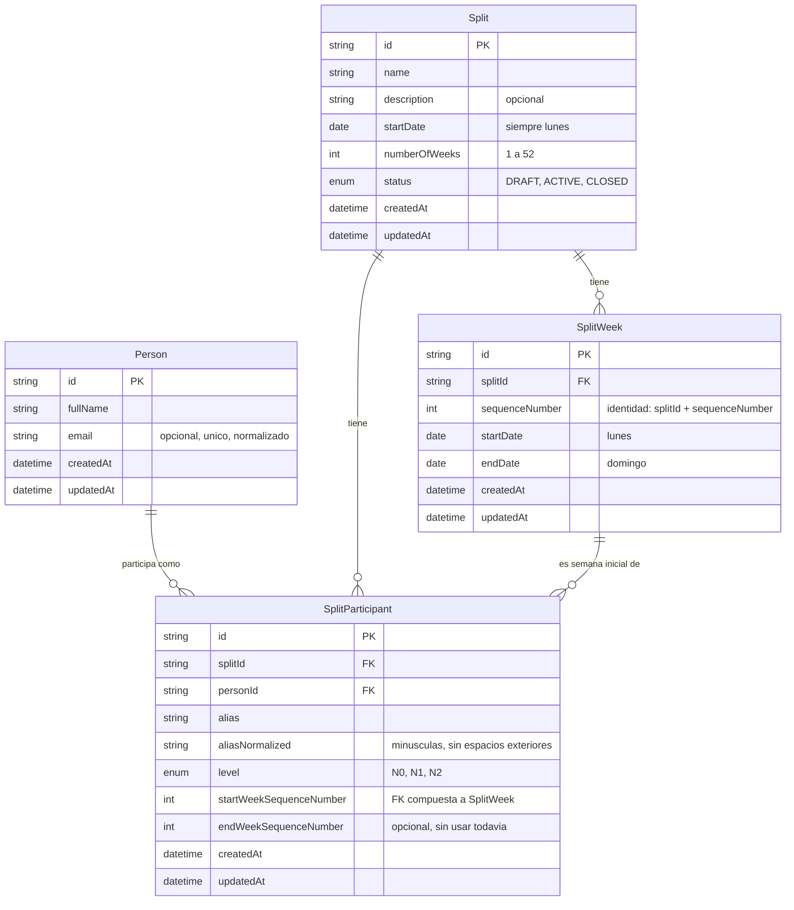

# Modelo de datos — MVP-1A

Fuente de verdad: `prisma/schema.prisma` y la migracion
`prisma/migrations/20260910133815_init/migration.sql`. Este documento
describe y explica ese esquema; en caso de discrepancia, el esquema real
manda.

## Diagrama entidad-relacion

## Tablas, campos y relaciones

### `Person`

Registro global y estable, reutilizable entre splits.

- `id`: UUID, clave primaria.
- `fullName`: nombre completo, obligatorio.
- `email`: opcional. Se normaliza (recortado y en minusculas) antes de
  guardarse, y tiene un indice unico (`Person_email_key`). Preparado para
  identificar en el futuro la cuenta del participante.
- `createdAt`, `updatedAt`: gestionados automaticamente.
- No existe borrado fisico en esta entrega. No se ha disenado todavia
  ninguna regla de baja o desactivacion: se ha pospuesto deliberadamente
  (ver `docs/DECISIONS.md`).

### `Split`

Una edicion de la gamificacion.

- `id`: UUID, clave primaria.
- `name`, `description` (opcional).
- `startDate`: columna `DATE` (sin hora). Restriccion de base de datos
  `Split_startDate_is_monday_check` que exige que sea lunes
  (`EXTRACT(ISODOW FROM "startDate") = 1`).
- `numberOfWeeks`: entero. Restriccion de base de datos
  `Split_numberOfWeeks_range_check` que exige un valor entre 1 y 52.
- `status`: enum `SplitStatus` (`DRAFT`, `ACTIVE`, `CLOSED`). Se crea
  siempre en `DRAFT`. El cierre funcional (`CLOSED`) no se implementa
  todavia; el estado queda preparado en el modelo.

### `SplitWeek`

Las semanas generadas de un split.

- `id`: UUID, clave primaria.
- `splitId`: referencia a `Split` (borrado en cascada si se borra el
  split).
- `sequenceNumber`: numero secuencial dentro del split (1, 2, 3...). Es la
  identidad funcional de la semana junto con `splitId`; el numero ISO del
  calendario no se guarda ni se usa como identidad.
- `startDate` / `endDate`: columnas `DATE`. Restricciones de base de datos
  que exigen que `startDate` sea lunes y `endDate` sea domingo.
- Indice unico `SplitWeek_splitId_sequenceNumber_key` sobre
  (`splitId`, `sequenceNumber`).

### `SplitParticipant`

La relacion entre una persona y un split, con sus datos propios de esa
participacion.

- `id`: UUID, clave primaria.
- `splitId`, `personId`: referencias a `Split` y `Person`.
- `alias`: tal como lo escribe el administrador.
- `aliasNormalized`: version normalizada (recortada y en minusculas),
  usada exclusivamente para garantizar la unicidad dentro del split.
  Restriccion de base de datos que impide que quede vacia.
- `level`: enum `ParticipantLevel` (`N0`, `N1`, `N2`).
- `startWeekSequenceNumber`: semana desde la que participa. Es una clave
  foranea **compuesta** hacia `SplitWeek` (`splitId` +
  `sequenceNumber`), lo que garantiza a nivel de base de datos que la
  semana inicial pertenece al mismo split.
- `endWeekSequenceNumber`: opcional, sin uso todavia. Preparado para un
  futuro cierre de participacion; cuando se use, debera referenciar una
  semana del mismo split (regla a aplicar en su momento, no forzada aun
  por una restriccion de base de datos).
- Indice unico `SplitParticipant_splitId_personId_key`: una persona solo
  puede aparecer una vez en un mismo split.
- Indice unico `SplitParticipant_splitId_aliasNormalized_key`: el alias
  normalizado es unico dentro del split (el mismo alias si puede
  repetirse en splits distintos).

## Decisiones sobre fechas

- Todas las fechas de negocio (`Split.startDate`, `SplitWeek.startDate`,
  `SplitWeek.endDate`) se guardan como columnas `DATE` de PostgreSQL, sin
  componente horario.
- En el codigo de la aplicacion (`src/lib/dates.ts`) estas fechas se
  representan siempre como `Date` de JavaScript a medianoche **UTC**, y se
  parsean/formatean explicitamente como fechas de calendario
  (`AAAA-MM-DD`). Esto evita el error tipico de que un lunes se convierta
  en domingo (o viceversa) por la zona horaria del proceso.
- La generacion de semanas (`generateSplitWeeks`) es una funcion pura que
  no depende de la hora actual ni de la zona horaria del servidor.

## Entidades pospuestas

Estas entidades aparecen en el contexto funcional del producto pero
**no** se han creado en esta entrega. Se documentan para que una futura
entrega no tenga que redescubrirlas:

- KPI, su configuracion por split y sus resultados calculados
  (`MVP-1B`, `MVP-1C`).
- Registros de carga de datos (Excel o manual) e importadores
  (`IMPORT-1`).
- Clasificacion general y su calculo acumulado (`MVP-1C`).
- Usuarios, autenticacion y sesiones.
- Facciones, profesiones, localizaciones, objetos, economia de creditos y
  renombre.
