# Diseño funcional — Gamification VCS

## Tabla de contenidos

1. [Ficha del documento](#1-ficha-del-documento)
2. [Resumen funcional](#2-resumen-funcional)
3. [Alcance de la versión](#3-alcance-de-la-versión)
4. [Roles, acceso y permisos](#4-roles-acceso-y-permisos)
5. [Mapa funcional y navegación](#5-mapa-funcional-y-navegación)
6. [Conceptos y modelo funcional](#6-conceptos-y-modelo-funcional)
7. [Flujo operativo de un Split](#7-flujo-operativo-de-un-split)
8. [Módulos funcionales](#8-módulos-funcionales)
   - [8.1 Noticias](#81-noticias)
   - [8.2 Personas y participantes](#82-personas-y-participantes)
   - [8.3 Gestión de Splits](#83-gestión-de-splits)
   - [8.4 KPI y carga de resultados](#84-kpi-y-carga-de-resultados)
   - [8.5 Resultados y clasificaciones](#85-resultados-y-clasificaciones)
   - [8.6 Profesiones y localizaciones](#86-profesiones-y-localizaciones)
   - [8.7 Economía, mercado y equipamiento](#87-economía-mercado-y-equipamiento)
   - [8.8 Badges y vitrina](#88-badges-y-vitrina)
   - [8.9 Analítica avanzada](#89-analítica-avanzada)
3. [Reglas transversales](#9-reglas-transversales)
4. [Validaciones, mensajes y casos límite](#10-validaciones-mensajes-y-casos-límite)
5. [Seguridad y datos tratados](#11-seguridad-y-datos-tratados)
6. [Anexo de pantallas](#12-anexo-de-pantallas)
7. [Trazabilidad y limitaciones](#13-trazabilidad-y-limitaciones)

---

## 1. Ficha del documento

| Campo | Valor |
|---|---|
| Título | Diseño funcional — Gamification VCS |
| Estado | As built (describe únicamente lo verificado en código y en la aplicación en ejecución) |
| Fecha de revisión | 2026-10-09 |
| Rama | `main` |
| Commit | `f706ecea9bd9a807238e13fd67f5c8fcb44808b3` ("Merge pull request #23 from bateman37/fix/1.2.4-badges-filtro-categorias") |
| Versión (`package.json`) | `1.2.3` |
| Referencia de tag | `v1.0.2-25-gf706ece` (sin etiqueta exacta sobre este commit; 25 commits por delante de `v1.0.2`) |
| Audiencia | Equipo de I+D e IT, y responsables funcionales que necesiten entender el producto antes de su publicación/rollout |
| Propósito | Documentar, de forma verificable, qué hace hoy la aplicación, quién puede hacer qué, y cómo se relacionan sus módulos — no qué se planea construir |

Este documento no describe hojas de ruta, mejoras propuestas ni funcionalidad pendiente. Cuando el roadmap o la documentación de producto (`docs/*.md`) mencionan algo "todavía no implementado", este documento lo omite o lo señala explícitamente como fuera de alcance.

---

## 2. Resumen funcional

**Gamification VCS** sustituye un libro Excel de seguimiento de KPI de un equipo de Customer Service por una aplicación web que modela correctamente sus conceptos de negocio: personas, **splits** (ediciones periódicas de la gamificación), semanas, KPI, resultados publicados y clasificación — y añade, sobre esa base operativa, una capa de juego (facciones, profesiones, localizaciones, economía/equipo y badges).

### 2.1. Necesidad cubierta

Antes de esta aplicación, el seguimiento de KPI y el reparto de puntos de la gamificación periódica se hacía en una hoja de cálculo con fórmulas replicadas manualmente. Gamification VCS centraliza la carga de datos (Excel para los orígenes masivos, formularios para los KPI manuales), calcula los resultados con las mismas fórmulas de forma auditable, publica una semana de forma inmutable y expone resultados individuales y de clasificación a cada perfil según lo que le corresponde ver.

### 2.2. Perfiles de usuario

- **Administrador (`ADMIN`)**: configura splits, KPI, participantes, carga/introduce datos, revisa y publica semanas, administra la capa de juego (facciones, profesiones, localizaciones, mercado), finaliza splits y consulta la analítica avanzada del equipo.
- **Participante (`PARTICIPANT`)**: consulta sus propios resultados (por split e histórico), su ficha (alias, avatar, profesión, equipo), la clasificación general (con alias, sin datos privados de otros) y las noticias que le corresponden.

### 2.3. Ciclo operativo real

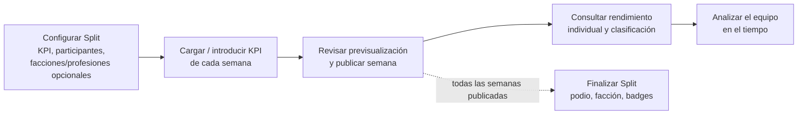
```mermaid
flowchart LR
    A[Configurar Split<br/>KPI, participantes,<br/>facciones/profesiones opcionales] --> B[Cargar / introducir KPI<br/>de cada semana]
    B --> C[Revisar previsualización<br/>y publicar semana]
    C --> D[Consultar rendimiento<br/>individual y clasificación]
    D --> E[Analizar el equipo<br/>en el tiempo]
    C -. todas las semanas publicadas .-> F[Finalizar Split<br/>podio, facción, badges]
```

Este documento distingue dos capas que conviven en la misma aplicación:

- **Capa de seguimiento operativo de KPI**: personas, splits, semanas, configuración de KPI, carga/introducción de datos, cálculo y publicación de resultados, clasificación general. Es la capa imprescindible; todo lo demás es opcional sobre ella.
- **Capa de gamificación**: facciones, profesiones, localizaciones semanales, economía de créditos/mercado/equipo visual y badges. Cada pieza de esta capa es opcional por split (un split sin facciones, sin profesiones, sin localizaciones y sin mercado configurado se comporta exactamente igual que sin esa capa) y se compone de forma **no encadenada**: cada bonus se calcula sobre la misma base y se suma una sola vez.

---

## 3. Alcance de la versión

### 3.1. Incluido y verificado en este commit

- Registro global de personas, reutilizables entre splits, con gestión de cuenta integrada (crear, activar/desactivar, restablecer contraseña).
- Creación y edición de splits en borrador, generación automática de semanas, activación condicionada (≥ 1 participante y ≥ 1 KPI activo, y si usa facciones, ≥ 3 miembros por facción).
- Catálogo cerrado de diez KPI de Split 8, configurables por split (activación, máximo base, multiplicadores por nivel N0/N1/N2, parámetros propios).
- Cuatro orígenes de carga por Excel (Productividad, Escalados, Calidad, Llamadas) y cinco entradas manuales (Guardián de la Estabilidad, Cronomagia laboral, Redactor estrella, Estudiante entusiasta, Aprendiz experto), cada una con su propia ruta de carga/introducción y comprobación.
- Asistencia semanal exclusivamente por horas totales (bloque obligatorio), con prioridad absoluta sobre cualquier KPI para decidir presencia/ausencia.
- Motor agregado de resultados semanales, previsualización en vivo con mapa de calor, publicación irreversible (instantánea inmutable) y bloqueo de cargas/configuración tras la primera publicación.
- Resultados individuales (`/resultados`, por split e histórico general) y clasificación general del split (resumen y vista detallada), con selector "Con gamificación"/"Sin gamificación".
- Facciones (opcionales), profesiones (opcionales, bonus fijo +20 %), localizaciones semanales (opcionales, bonus 10–50 %), economía de créditos, mercado, ranuras de equipo visual y catálogo de objetos (bonus 10–50 %, acumulativo entre objetos de ranuras distintas).
- Centro de noticias interno (bandeja, campana, envío manual segmentado).
- Finalización formal de un split (podio, facción ganadora, ganadores por KPI, noticia final).
- Badges: catálogo cerrado de 14 categorías, concesión automática al finalizar un split, histórico `legacy-badges-v1` importable, clasificación general y vitrina personal.
- Analítica avanzada (`/analitica`, exclusiva de `ADMIN`): seis bloques de lectura sobre semanas publicadas.

### 3.2. Límites observados (no son carencias a corregir, son el diseño actual)

- **No existe despublicar/reabrir una semana**, ni exportación Excel/PDF de resultados, ni transferencias, regalos, reventa ni misiones (confirmado en `README.md` y en el propio servicio de publicación, que no expone ninguna acción de reversión).
- **No existe "Reabrir split"**: `finalizeSplit` es la única operación que lleva `Split.status` a `CLOSED`, y es definitiva en esta versión (`docs/SPLIT_FINALIZATION.md`).
- **No hay recuperación de contraseña por correo**: el administrador fija siempre la contraseña temporal (`docs/AUTHENTICATION.md`).
- **La configuración de KPI y los puntos por posición quedan bloqueados** en cuanto el split tiene al menos una semana publicada; igualmente, profesiones/localizaciones/facciones quedan bloqueadas desde la primera publicación (profesiones y facciones) o desde el inicio de cada semana (localizaciones).
- **Módulos exclusivos de administrador**: Personas, Splits (y todo lo que cuelga de ellos, incluidas cargas de KPI y clasificación detallada), envío manual de noticias, analítica avanzada y administración histórica de badges. Un participante nunca ve estos enlaces ni puede acceder escribiendo la URL.
- **Dependencias de configuración**: el mercado de un split empieza siempre `CERRADO` y exige al menos una ranura activa y un objeto válido para abrirse; una localización exige un KPI activo del split; una profesión exige exactamente dos KPI distintos del catálogo.

---

## 4. Roles, acceso y permisos

La protección ocurre en dos capas verificadas en código: `src/middleware.ts` (por ruta, en cada petición) y `requireSession()`/`requireAdminSession()` (`src/lib/session.ts`) dentro de cada página y acción de servidor sensible. Ninguna pantalla ni acción acepta un `personId` recibido del navegador: siempre se resuelve `session.user.personId` en servidor.

### 4.1. Matriz módulo / acción / rol

| Módulo | Consultar | Crear / editar | Publicar / finalizar | Rol autorizado |
|---|---|---|---|---|
| Personas y cuentas | — | Sí | — | Solo `ADMIN` |
| Splits (alta, edición, activación) | Sí (listado y detalle) | Sí | — | Solo `ADMIN` |
| Carga/introducción de KPI semanal | Sí ("Comprobar") | Sí ("Cargar"/"Introducir", solo semana no publicada) | — | Solo `ADMIN` |
| Previsualización de resultados de una semana | Sí | — | Sí ("Publicar semana") | Solo `ADMIN` |
| Resultados propios (`/resultados`) | Sí (propio) | — | — | `ADMIN` y `PARTICIPANT` (participante: solo los suyos) |
| Selector de persona en Resultados | Sí (cualquier persona) | — | — | Solo `ADMIN` |
| Clasificación general detallada (`/splits/[id]/clasificacion*`) | Sí | — | — | Solo `ADMIN` (el participante ve una versión limitada dentro de `/resultados`) |
| Presentar resultados (modo proyección) | Sí | — | — | Solo `ADMIN` |
| Facciones del split | Sí | Sí (según estado del split) | — | Solo `ADMIN` |
| Profesiones del split | Sí | Sí (antes de la 1ª publicación) | — | Solo `ADMIN` |
| Localizaciones semanales | Sí | Sí (antes de `startDate` de la semana) | — | Solo `ADMIN` |
| Economía: mercado, ranuras, catálogo de objetos | Sí | Sí (mercado cerrado) | Sí (abrir/cerrar mercado) | Solo `ADMIN` |
| Fichas (`/fichas`) — alias, avatar, profesión propios | Sí (propia) | Sí (propia) | — | `ADMIN` y `PARTICIPANT`, solo su propia ficha |
| Configurar personaje (comprar/equipar objeto propio) | Sí (propio) | Sí (propio) | — | `ADMIN` y `PARTICIPANT`, solo su propia participación |
| Noticias (bandeja propia) | Sí (propia) | leer/archivar propia | — | `ADMIN` y `PARTICIPANT` |
| Envío manual de noticias | Sí (historial) | Sí | — | Solo `ADMIN` |
| Finalizar split | Sí (resumen) | — | Sí | Solo `ADMIN` |
| Badges: clasificación general | Sí | — | — | `ADMIN` y `PARTICIPANT` |
| Badges: vitrina propia / de una persona | Sí (propia; `ADMIN` puede elegir cualquiera) | — | — | `ADMIN` y `PARTICIPANT` (participante: solo la suya) |
| Badges: administración histórica (`legacy-badges-v1`) | Sí | Sí (importar, vincular) | — | Solo `ADMIN` |
| Analítica avanzada (`/analitica`) | Sí | — | — | Solo `ADMIN` |

Tabla completa y fuente primaria: `docs/AUTHENTICATION.md` (matriz de permisos verificada contra `src/middleware.ts` y los `requireAdminSession()` de cada acción).

### 4.2. Autenticación y ciclo de cuenta

- Autenticación local (Auth.js/NextAuth v4, `CredentialsProvider`: correo + contraseña), sesión `JWT` firmada, sin SSO ni proveedores externos.
- El primer administrador se crea con un script de línea de comandos (`npm run db:create-admin`), nunca desde la interfaz.
- Cualquier cuenta nueva (administrador inicial, o cuenta de participante creada desde `/personas`) nace con `mustChangePassword = true`: el middleware redirige a `/cuenta/cambiar-contrasena` y bloquea cualquier otra ruta hasta que se cambie la contraseña (figura 29).
- Tras cambiar la contraseña, la sesión se cierra para forzar un nuevo inicio (el JWT no se relee de base de datos en cada petición).
- Un acceso no autorizado a una ruta exclusiva de administrador (por ejemplo, escribir `/splits` siendo `PARTICIPANT`) se resuelve con una redirección silenciosa a `/noticias`, nunca con un error expuesto.

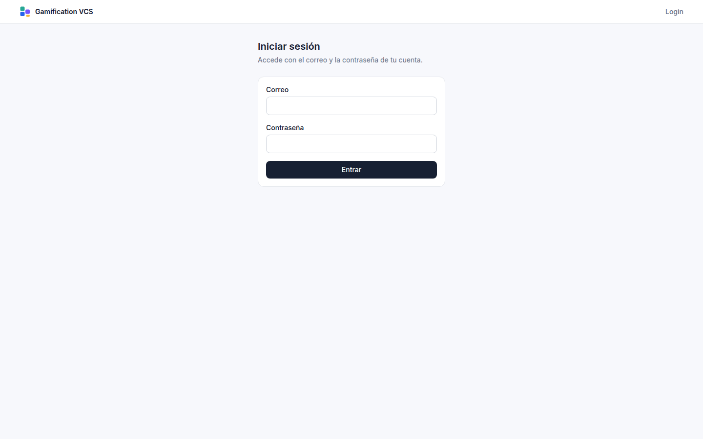
*Figura 01. Pantalla de inicio de sesión.*

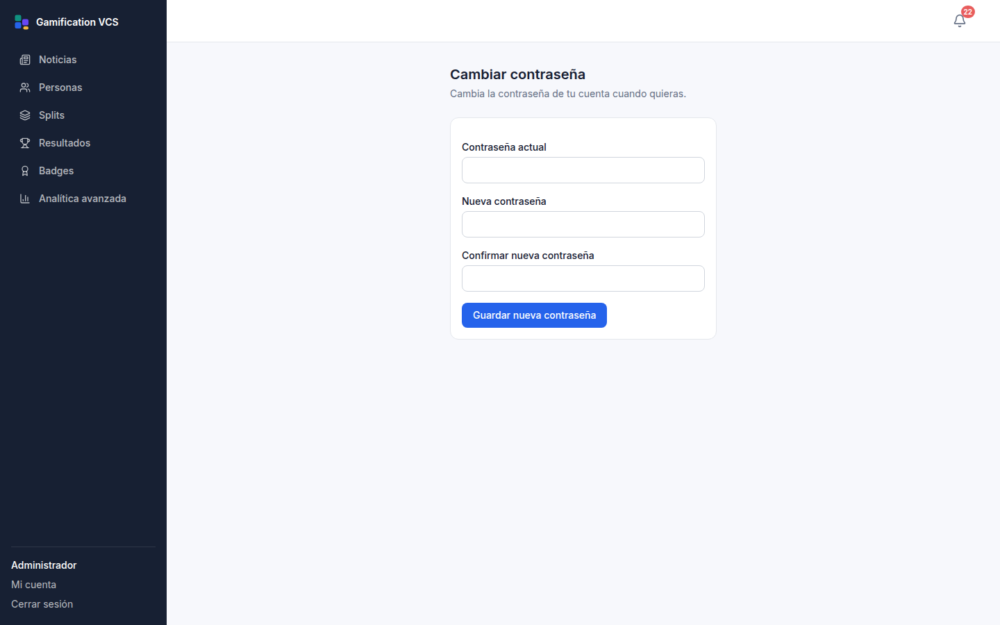
*Figura 29. Cambio de contraseña — el mismo formulario al que redirige el middleware en el primer acceso cuando `mustChangePassword` está activo.*

### 4.3. Relación persona / cuenta / participante

- **`Person`** es el registro global, reutilizable entre splits (una persona puede tener cero, una o varias participaciones).
- **`User`** es la cuenta de acceso: un `PARTICIPANT` está vinculado uno a uno con una `Person` (`personId` único y obligatorio de facto); un `ADMIN` puede no estar vinculado a ninguna persona (en ese caso, `/fichas` y `/resultados` para su propia persona le muestran un estado vacío explícito, ver figura 24).
- **`SplitParticipant`** es la participación de una persona en un split concreto (alias propio del split, nivel técnico, semana inicial/final, facción y profesión si el split las usa). Una persona con cuentas creadas en distintas participaciones sigue siendo la misma `Person` a efectos de resultados históricos, analítica y badges.

---

## 5. Mapa funcional y navegación

La fuente única del orden de navegación es `buildNavItems` (`src/components/nav-items.ts`), usada tanto en la barra lateral de escritorio como en el menú móvil (`AppShell.tsx`/`MobileNav.tsx`).

### 5.1. Administrador

| Entrada | Ruta | Objetivo |
|---|---|---|
| Noticias | `/noticias` | Bandeja personal de novedades (primera opción) |
| Personas | `/personas` | Alta y gestión de personas y sus cuentas |
| Splits | `/splits` | Listado, alta y detalle de cada split (incluye KPI, semanas, participantes, facciones, profesiones, economía, puntos por posición) |
| Resultados | `/resultados` | Selector de persona, resultados por split e histórico general |
| Badges | `/badges` | Clasificación general y vitrina de badges; enlace a administración histórica |
| Analítica avanzada | `/analitica` | Seis bloques de análisis del equipo sobre semanas publicadas |
| Mi cuenta | `/cuenta/cambiar-contrasena` | Cambio de la propia contraseña |
| Fichas (condicional) | `/fichas` | Solo si la cuenta de administrador está vinculada a una `Person` |

### 5.2. Participante

| Entrada | Ruta | Objetivo |
|---|---|---|
| Noticias | `/noticias` | Bandeja personal |
| Resultados | `/resultados` | Resultados propios por split e histórico |
| Badges | `/badges` | Clasificación general y "Mi vitrina" |
| Fichas | `/fichas` | Una ficha por participación: alias, avatar, profesión, "Configurar personaje" |
| Mi cuenta | `/cuenta/cambiar-contrasena` | Cambio de la propia contraseña |

### 5.3. Sin autenticar

Solo `/login`. El acceso raíz `/` redirige siempre a `/noticias` para cualquier sesión válida.

---

## 6. Conceptos y modelo funcional

| Entidad | Propósito | Datos principales | Propietario funcional | Se edita / bloquea |
|---|---|---|---|---|
| **Persona** (`Person`) | Identidad real, reutilizable entre splits | Nombre completo, correo opcional | Administrador (alta/edición) | Siempre editable por un administrador |
| **Cuenta** (`User`) | Acceso a la aplicación | Correo, rol, vínculo a persona, estado activo | Administrador (gestión); la propia persona (contraseña) | Contraseña: la propia persona; activación: administrador |
| **Participante** (`SplitParticipant`) | Participación de una persona en un split | Alias del split, nivel técnico (N0/N1/N2), semana inicial/final, facción y profesión (si aplican) | Administrador (alta); participante (alias y profesión propia, mientras no esté bloqueado) | Alias/profesión bloqueados tras la primera publicación (profesión) o nunca (alias); nivel/facción/semanas: solo administrador |
| **Split** | Edición periódica de la gamificación | Nombre, fechas, número de semanas, estado (`DRAFT`/`ACTIVE`/`CLOSED`) | Administrador | Activación exige ≥1 participante y ≥1 KPI activo; `CLOSED` es definitivo |
| **Semana** (`SplitWeek`) | Unidad temporal de carga y publicación | Número de secuencia, fecha inicio (lunes)/fin (domingo) | Administrador (generada automáticamente al crear el split) | Bloqueada en cuanto está publicada |
| **KPI** (`SplitKpiConfig`) | Indicador configurable por split, de un catálogo cerrado de 10 | Activo/inactivo, máximo base, multiplicadores N0/N1/N2, parámetros propios | Administrador | Bloqueado desde la primera publicación del split |
| **Resultado semanal** (`PublishedParticipantWeeklyResult`/`PublishedKpiResult`) | Instantánea inmutable de una semana publicada | Puntos por KPI, total, posición, puntos por posición, bonus, créditos, asistencia | Sistema (generado al publicar) | Inmutable: nunca se recalcula ni se edita |
| **Alias** | Nombre visible del participante dentro del split | Texto único por split | Administrador / participante propio | Editable mientras el split no esté `CLOSED` |
| **Nivel** (`ParticipantLevel`) | Jerarquía técnica (N0/N1/N2) que modula multiplicadores | Valor fijo por participación | Administrador | Solo administrador |
| **Puntos por posición** (`SplitPositionPointRule`) | Configuración de puntos otorgados según la posición semanal | Tabla posición → puntos (1..N, N dinámico) | Administrador | Bloqueada tras la primera publicación; nunca se recorta una fila ya guardada |
| **Créditos** (`CreditLedgerEntry`) | Moneda del split, derivada de los puntos KPI publicados | Movimientos inmutables (`WEEKLY_EARNING`, `PURCHASE`) | Sistema (generación); participante (gasto) | Saldo = suma de movimientos, nunca un campo materializado editable |
| **Facción** (`SplitFaction`) | Agrupación opcional de participantes | Nombre, color, imagen opcional | Administrador | Editable/eliminable según estado del split |
| **Profesión** (`SplitProfession`) | Rol opcional con bonus fijo +20 % sobre dos KPI | Nombre, niveles disponibles, dos KPI distintos | Administrador (definición); participante (elección propia) | Bloqueada (definición y asignación) desde la primera publicación |
| **Localización** (`SplitWeekLocation`) | Potenciador opcional de un KPI, por semana | Nombre, un KPI activo, bonus 10–50 % | Administrador | Editable solo antes de `startDate` de esa semana |
| **Mercado** (`SplitEconomySettings`) | Estado abierto/cerrado de la compra de objetos | Estado (`ABIERTO`/`CERRADO`) | Administrador | Abrir exige split activo + ≥1 ranura + ≥1 objeto válido |
| **Ranura** (`SplitEquipmentSlot`) | Posición visual de equipo (catálogo cerrado de 10) | Nombre visible, posición visual, estado activo/inactivo | Administrador | Administrable solo con mercado cerrado |
| **Objeto** (`SplitStoreItem`) | Artículo del catálogo, bonus 10–50 % sobre un KPI | Nombre, descripción, precio, ranura, KPI, porcentaje, imagen opcional | Administrador (definición); inmutable tras la 1ª compra salvo imagen | Administrable solo con mercado cerrado |
| **Inventario / equipo** (`SplitParticipantItem`/`SplitParticipantEquippedItem`) | Objetos comprados y equipados por un participante | Propiedad permanente; como mucho un objeto equipado por ranura | Participante propio | El equipo confirmado es el que cuenta al publicar |
| **Noticia** (`NewsItem`/`NewsDelivery`) | Evento de negocio notificado | Texto plano inmutable, categoría, destinatario, estado leído/archivado | Sistema (generación); destinatario (leído/archivado) | El texto nunca se edita tras enviarse |
| **Badge** (`BadgeAward`) | Medalla permanente de una persona | Categoría, split de origen, fecha, snapshot de nombres | Sistema (al finalizar un split) | Inmutable tras concederse |
| **Ausencia / sin dato** | Estado de una celda o de asistencia | `VAC`/`AVISO` (mostrado como `0` numérico), `No aplica`, `Ausencia` (asistencia) | Sistema (calculado) | No se persiste como fila artificial salvo la asistencia, que es su propio bloque de datos |

---

## 7. Flujo operativo de un Split

### 7.1. Ciclo completo verificado

1. **Crear y configurar el split** (`ADMIN`, `/splits/nuevo` → `/splits/[id]`): nombre, fecha de inicio (lunes) y número de semanas; el sistema genera automáticamente las `SplitWeek` correspondientes. El split nace `DRAFT`.
2. **Configurar KPI y puntos por posición**: activar los KPI que aplican de los diez del catálogo, ajustar máximos/multiplicadores/parámetros, y revisar la tabla de puntos por posición (valores por defecto precargados, ver figura 10).
3. **Añadir participantes**: persona existente o nueva, alias propio del split, nivel técnico y semana inicial. Si el split ya usa facciones, la facción es obligatoria en el propio formulario; lo mismo ocurre con la profesión tras la primera publicación.
4. **Funciones opcionales de juego** (todas opcionales y pueden configurarse en cualquier momento mientras no estén bloqueadas): facciones, profesiones, localizaciones por semana, ranuras de equipo y catálogo de objetos.
5. **Activar el split**: exige al menos un participante y al menos un KPI activo (y, si usa facciones, ≥3 miembros por facción). El split pasa a `ACTIVE`.
6. **Introducir/importar resultados de una semana**: Excel (Productividad/Escalados/Calidad/Llamadas) o formulario manual (los cinco KPI restantes), por cada KPI activo. Cada origen tiene su propia pantalla de carga/introducción y de comprobación.
7. **Revisar la previsualización**: en cuanto todos los KPI activos de la semana están cargados, aparece "Ver resultados de la semana" con la tabla, el mapa de calor y la clasificación de facciones (si aplica) en vivo, sin persistir nada.
8. **Publicar la semana**: acción irreversible, con confirmación explícita. Crea una instantánea inmutable (`WeekPublication` + `PublishedParticipantWeeklyResult`/`PublishedKpiResult`), genera créditos, bloquea cualquier edición posterior de las cargas/configuración de esa semana, y dispara una noticia personalizada por participante (más avisos administrativos si procede).
9. **Consultar resultados**: vista individual (`/resultados`, por split e histórico), clasificación general del split (resumen y detalle), clasificación de facciones si aplica, y la propia ficha del participante.
10. **Finalizar el split** (si todas sus semanas están publicadas): un administrador puede cerrar formalmente el split (`Split.status = CLOSED`), lo que calcula el podio, la facción ganadora y los ganadores por KPI, cierra el mercado, concede los badges correspondientes y envía la noticia final.

### 7.2. Estados verificados de un Split

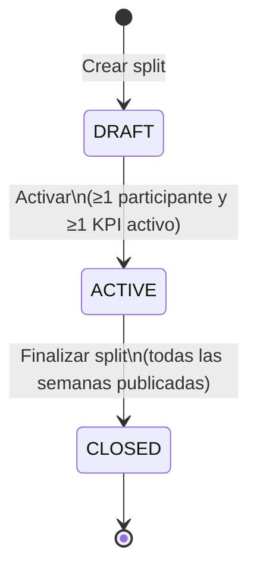
```mermaid
stateDiagram-v2
    [*] --> DRAFT: Crear split
    DRAFT --> ACTIVE: Activar\n(≥1 participante y ≥1 KPI activo)
    ACTIVE --> CLOSED: Finalizar split\n(todas las semanas publicadas)
    CLOSED --> [*]
```

No existe transición de vuelta desde `ACTIVE` a `DRAFT` ni desde `CLOSED` a ningún otro estado: confirmado en `src/server/services/finalize-split.service.ts` (única operación que escribe `CLOSED`) y en la ausencia de cualquier acción "Reabrir split" o "Despublicar" en el código de acciones de servidor.

### 7.3. Estados de una semana

| Estado visible | Significado | Quién lo ve |
|---|---|---|
| `Pendiente` (rojo) | Faltan datos de uno o más KPI activos | `ADMIN` |
| `Carga parcial` (amarillo) | Reservado exclusivamente a Domador de Escaladas, cuando existe solo uno de sus dos orígenes (Excel de Escalados o Productividad de esa semana) | `ADMIN` |
| `Cargado` (verde) | Carga confirmada, aunque falten participantes aplicables (se expresa como `n AVISO`, calculado al consultar) | `ADMIN` |
| `Publicada` | La semana tiene una instantánea inmutable; ninguna carga de esa semana es ya editable | `ADMIN` y `PARTICIPANT` (resultado visible según su alcance) |

### 7.4. Efectos automáticos y noticias por etapa

| Etapa | Noticia generada | Bloqueos que activa |
|---|---|---|
| Alta de participante | Noticia al propio participante (si tiene cuenta) | — |
| Activación del split | Aviso administrativo | — |
| Semana con todos los KPI cargados | Aviso administrativo único ("semana lista para revisar") | — |
| Publicación de semana | Una noticia personalizada por participante + avisos administrativos | Bloquea cargas/configuración de esa semana; bloquea KPI y puntos por posición de todo el split si es la primera publicación; bloquea profesiones/facciones si es la primera publicación |
| Cambio de facción/profesión/localización/mercado | Una noticia por cambio real (idempotente) | — |
| Compra de un objeto | Noticia al comprador | — |
| Finalización del split | Noticia final a todos los participantes + aviso administrativo | Congela `Split.status = CLOSED`; cierra el mercado; concede badges |

---

## 8. Módulos funcionales

### 8.1. Noticias

- **Objetivo**: centro de notificaciones interno para cualquier usuario autenticado, con un registro auditable de los eventos relevantes de los splits en los que participa o administra.
- **Usuarios**: `ADMIN` y `PARTICIPANT` (bandeja propia); solo `ADMIN` para el envío manual.
- **Pantallas/rutas**: `/noticias` (bandeja, pestañas Todas/No leídas/Archivadas, filtros de split y categoría, paginación por cursor — figuras 2 y 30); `/noticias/administrar` (envío manual segmentado por split, facción o persona — figura 3).
- **Datos**: `NewsItem` (texto plano inmutable, categoría, prioridad) y `NewsDelivery` (destinatario, leída/archivada). Once categorías: Split, Ficha, Resultados, Facción, Profesión, Localización, Mercado, Compra, Anuncio, Administración, Badges.
- **Acciones**: marcar leída/no leída, archivar (solo sobre la propia bandeja); enviar noticia manual (solo `ADMIN`).
- **Reglas**: una noticia de jugador se entrega siempre a `Person` (`recipientPersonId`), nunca solo a `User`, para que llegue aunque la cuenta todavía no exista; la de administración se entrega a `recipientUserId`. No hay backfill histórico: la bandeja registra eventos solo desde el despliegue de `1.0.0`. Cada evento automático es idempotente mediante una clave estable o un UUID de operación.
- **Estados vacíos**: "Todavía no se ha enviado ninguna noticia manual" (figura 3) cuando no hay historial de envíos.
- **Figuras**: 2, 3, 30.

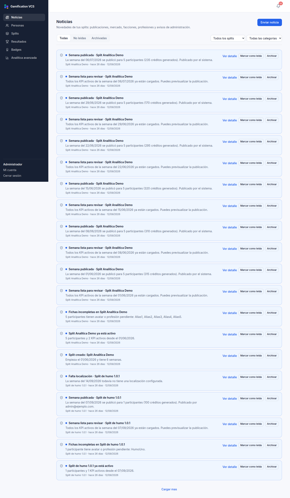
*Figura 02. Bandeja de noticias del administrador.*

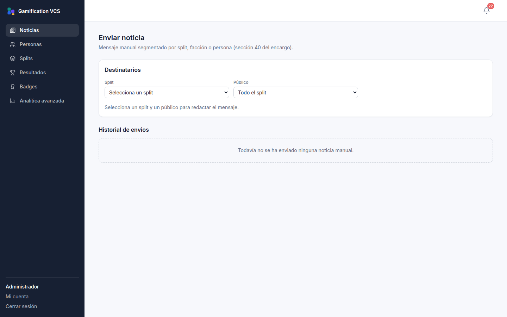
*Figura 03. Envío manual de noticias (administrador).*

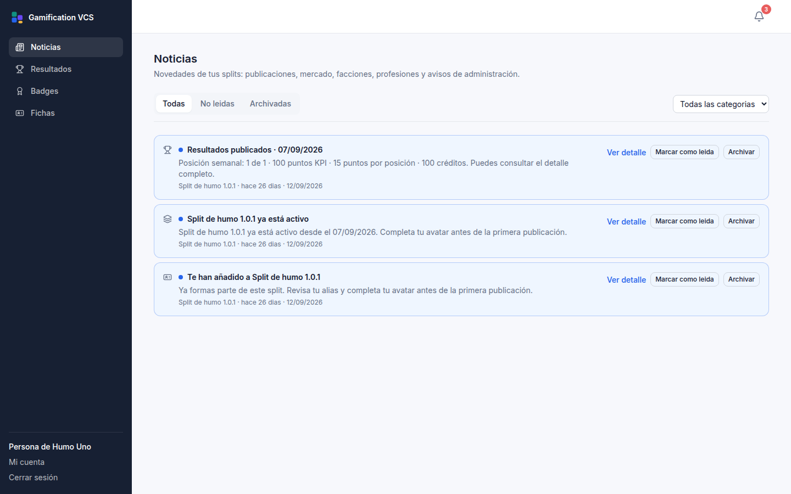
*Figura 30. Bandeja de noticias del participante.*

### 8.2. Personas y participantes

- **Objetivo**: mantener un registro global de personas, reutilizable entre splits, y gestionar sus cuentas de acceso.
- **Usuarios**: solo `ADMIN`.
- **Pantallas/rutas**: `/personas` (alta y listado — figura 4); alta de participante y listado de participantes dentro de `/splits[id]`; cada persona ve su propia identidad por participación en `/fichas` (figuras 24 y 33), resuelta siempre desde `session.user.personId`, nunca desde un parámetro del navegador.
- **Datos**: nombre completo, correo opcional, cuenta asociada (correo, estado activo), número de splits en los que participa.
- **Acciones**: crear persona; crear cuenta vinculada (correo + contraseña temporal); activar/desactivar cuenta; restablecer contraseña temporal; añadir participante a un split (persona existente o nueva, alias, nivel, semana inicial, facción/profesión si aplican).
- **Reglas**: un alias es único dentro de su split (no entre splits). La semana inicial debe ser una semana no publicada o futura; se rechaza si cae en una semana ya publicada. Tras la primera publicación, un alta nueva exige elegir profesión en el propio formulario si el split las usa. Una cuenta de `ADMIN` sin persona vinculada ve un estado vacío explícito en `/fichas` (figura 24), nunca los datos de otra persona.
- **Figuras**: 4, 24, 33.

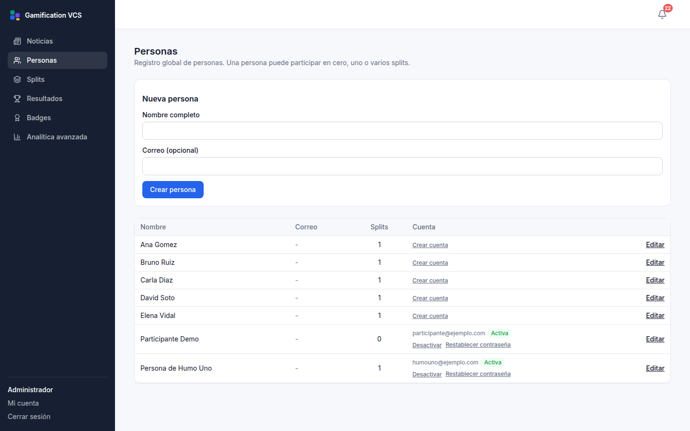
*Figura 04. Gestión de personas y cuentas.*

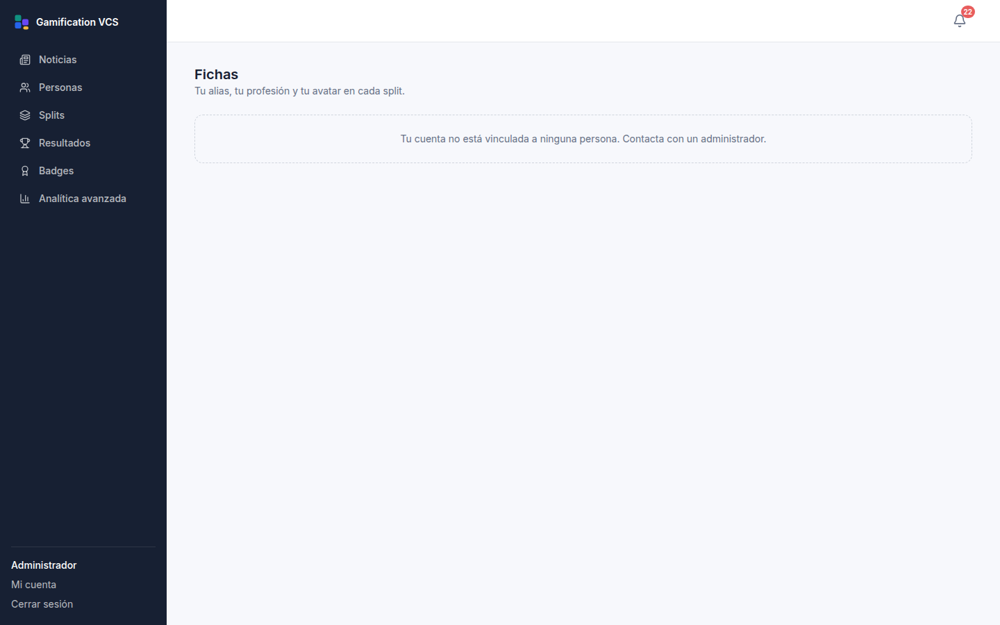
*Figura 24. «Fichas» para una cuenta de administrador sin persona vinculada.*

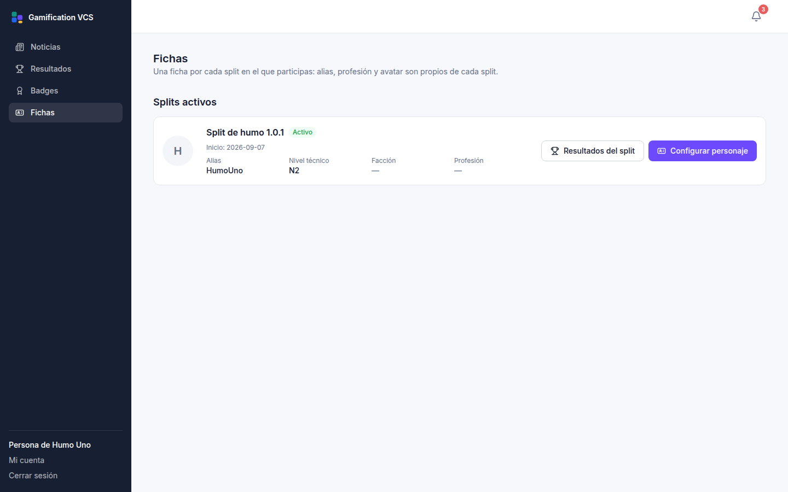
*Figura 33. «Fichas» del participante: tarjeta del split activo.*

### 8.3. Gestión de Splits

- **Objetivo**: crear y administrar cada edición de la gamificación: calendario de semanas, KPI, participantes, y toda la capa de juego opcional, desde una única pantalla de detalle con submenú lateral.
- **Usuarios**: solo `ADMIN`.
- **Pantallas/rutas**: `/splits` (listado — figura 5); `/splits/[id]` (detalle de una sola página con anclas: Resumen, Calendario de semanas, Presentar resultados, Clasificación general individual/facciones, Facciones, Profesiones, Economía y mercado, Participantes, Añadir participante, KPI del split, Puntos por posición semanal, Editar split — figuras 6 a 12).
- **Datos**: nombre, fechas, número de semanas, estado, KPI activos, puntos por posición, facciones, profesiones, resumen de economía.
- **Acciones**: crear/editar split (borrador); activar split; configurar KPI (individual o "Guardar todos los KPI"); configurar puntos por posición; crear/editar/eliminar facción o profesión (según estado); añadir participante; finalizar split (cuando corresponde).
- **Reglas**: activar exige ≥1 participante y ≥1 KPI activo (y ≥3 miembros por facción si las usa). KPI y puntos por posición quedan bloqueados en cuanto hay una semana publicada (figura 10 muestra el aviso "La configuración quedó bloqueada al publicar la primera semana del split"). Un split sin ninguna facción/profesión/localización/mercado configurado funciona exactamente igual que sin esa capa (figura 12 muestra ambos mensajes de "todavía no utiliza...").
- **Estados vacíos**: "Todavía no hay ninguna facción configurada. Crea al menos dos para poder activar este split." (figura 6); "Este split todavía no tiene ningún objeto en el catálogo." (figura 15).
- **Figuras**: 5, 6, 7, 8, 9, 10, 11, 12, 15.

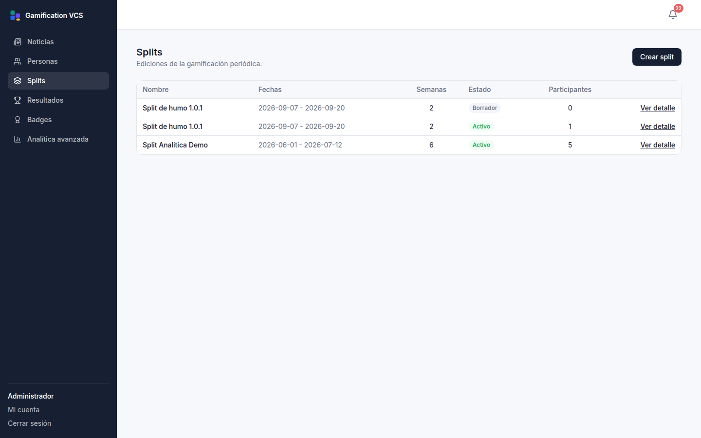
*Figura 05. Listado de Splits.*

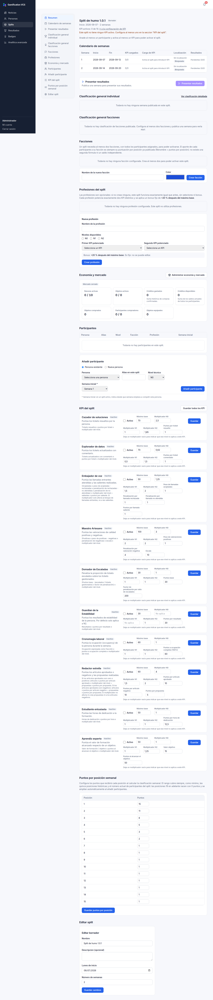
*Figura 06. Detalle de un split en borrador: facciones, profesiones, KPI y puntos por posición sin configurar.*

*Figura 07. Resumen de un split activo, con el botón «Finalizar split».*

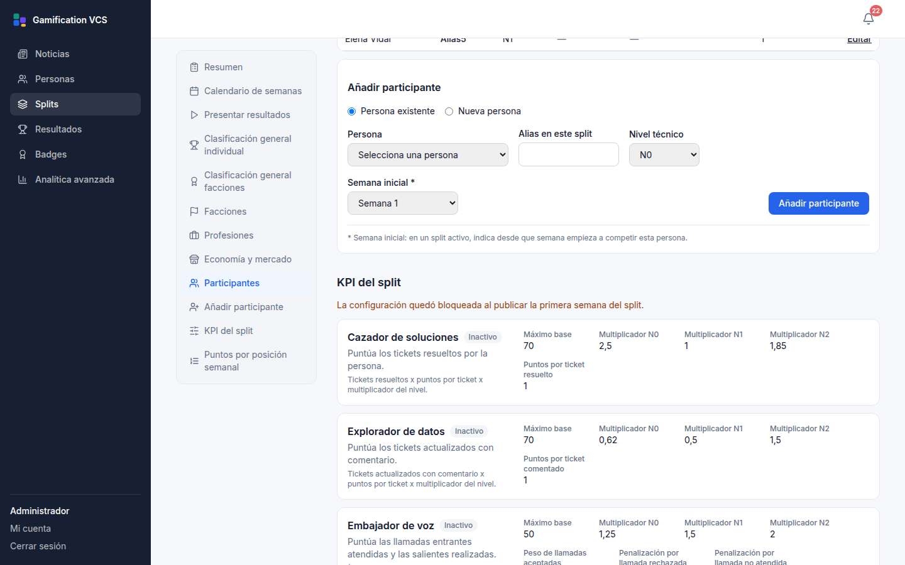
*Figura 08. Participantes y configuración de los diez KPI del catálogo.*

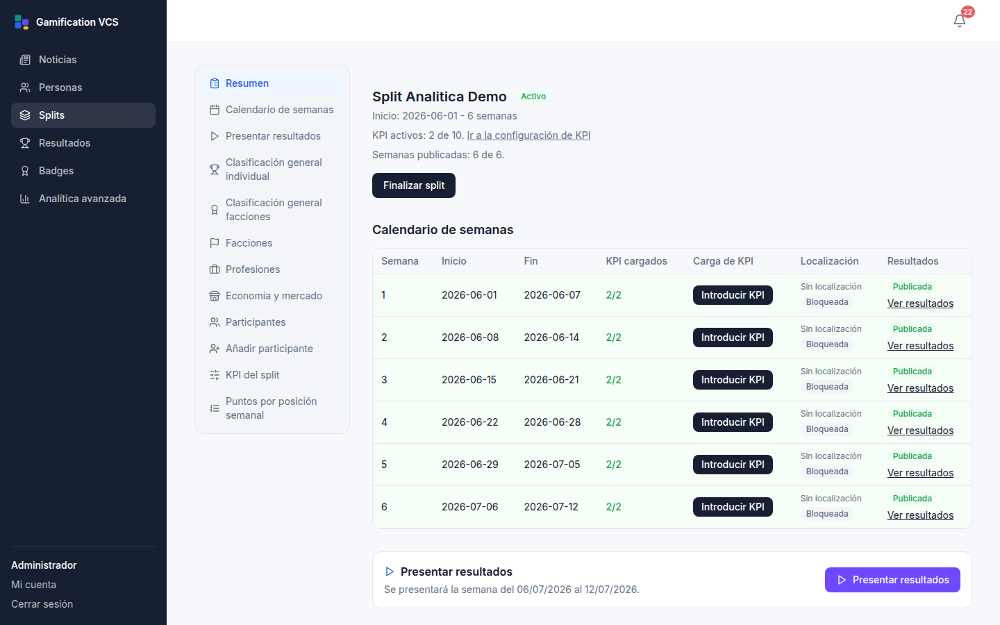
*Figura 09. Calendario de semanas, «Presentar resultados» y clasificación general.*

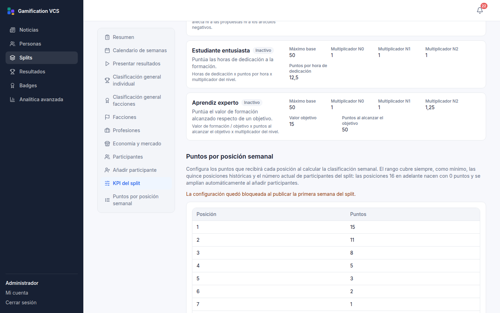
*Figura 10. KPI inactivos y tabla de puntos por posición semanal, bloqueada tras la primera publicación.*

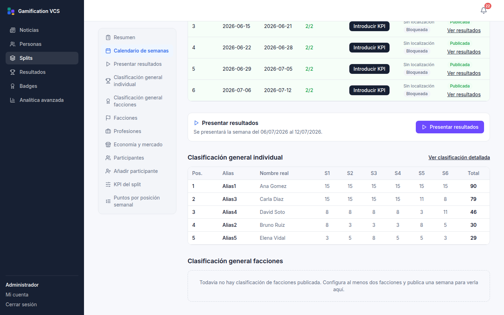
*Figura 11. Clasificación general individual (resumen) y clasificación de facciones vacía.*

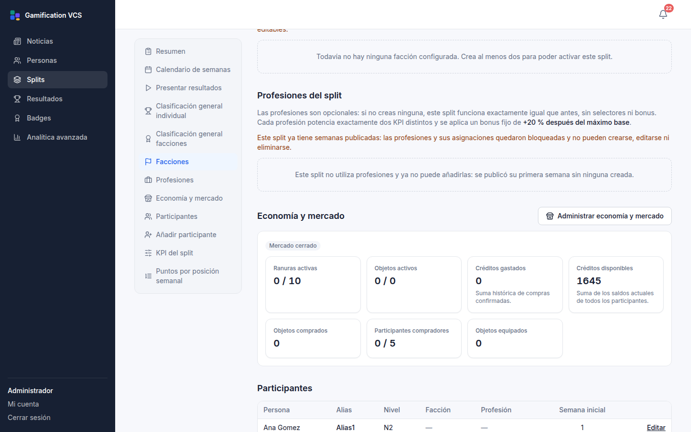
*Figura 12. Bloqueo de facciones/profesiones tras publicar y resumen de «Economía y mercado».*

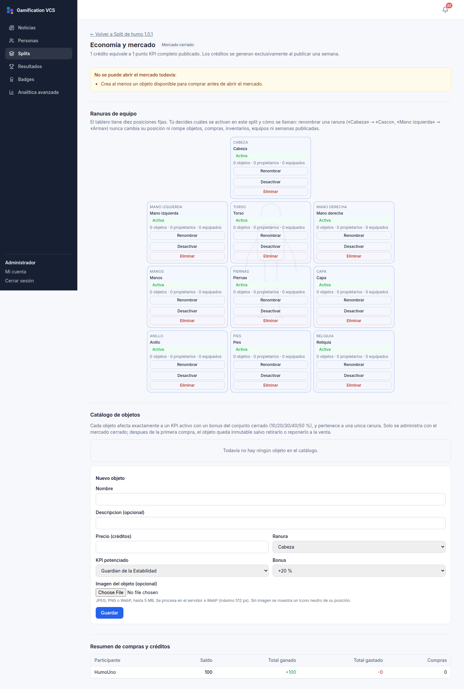
*Figura 15. Editor de ranuras de equipo y catálogo de objetos, con mercado cerrado.*

### 8.4. KPI y carga de resultados

- **Objetivo**: capturar, por semana, el dato real de cada KPI activo del split, calcularlo con la fórmula fija de su categoría y dejar un rastro auditable (previsualización, comprobación posterior).
- **Usuarios**: solo `ADMIN` (introducir/cargar); la comprobación de una semana publicada es de solo lectura pero sigue siendo exclusiva de `ADMIN` (los resultados ya calculados llegan al participante por `/resultados`, no por esta pantalla).
- **Pantallas/rutas**: `/splits/[id]/weeks/[weekId]/kpis` (panel de la semana con un grupo por origen — figuras 16 y 17); `.../kpis/<origen>/cargar` o `/introducir` (figura 18); `.../kpis/<origen>/comprobar` (figura 19).
- **Catálogo cerrado de 10 KPI** (`src/domain/kpis/catalog.ts`), con su fórmula funcional, máximo base y multiplicadores por defecto:

| KPI | Origen | Fórmula funcional | Máximo base por defecto | Multiplicador N0/N1/N2 por defecto |
|---|---|---|---|---|
| Cazador de soluciones | Excel Productividad | Tickets resueltos × puntos por ticket × multiplicador de nivel | 70 | 2,5 / 1 / 1,85 |
| Explorador de datos | Excel Productividad | Tickets comentados × puntos por ticket × multiplicador de nivel | 70 | 0,62 / 0,5 / 1,5 |
| Embajador de voz | Excel Llamadas | (Aceptadas × peso − rechazadas × penalización − no atendidas × penalización) × multiplicador + salientes × puntos por saliente (el multiplicador solo afecta al bloque entrante) | 50 | 1,25 / 1,5 / 2 |
| Maestro Artesano | Excel Calidad | (Positivas × peso − negativas × penalización) × escala × multiplicador de nivel | 100 | 3 / 2 / 2 |
| Domador de Escaladas | Excel Escalados + Productividad (unidos por semana + participante) | (Puntos base − (escalados / tickets gestionados) × factor de penalización) × multiplicador de nivel | 30 | 1 / 1 / 1 |
| Guardián de la Estabilidad | Manual (solo N2 por defecto) | Resultados × puntos por resultado × multiplicador de nivel | 30 | — / — / 1 |
| Cronomagia laboral | Manual | Ocupación (fracción) × puntos a ocupación completa × multiplicador de nivel | 60 | 1 / 1 / 1 |
| Redactor estrella | Manual | Si aprobados ≥ 0: artículos × puntos por artículo aprobado × multiplicador + propuestas × puntos por propuesta. Si aprobados < 0: artículos × puntos por artículo negativo (sin multiplicador) + propuestas | 60 | 4 / 1,5 / 2 |
| Estudiante entusiasta | Manual | Horas de dedicación × puntos por hora × multiplicador de nivel | 50 | 1 / 1 / 1 |
| Aprendiz experto | Manual | (Valor de formación / objetivo) × puntos al alcanzar el objetivo × multiplicador de nivel | 50 | 1 / 1 / 1,25 |

  Fuente: `src/domain/kpis/catalog.ts` (valores editables por split; los de la tabla son los predeterminados de Split 8).

- **Límites y multiplicadores**: cada KPI tiene un máximo base configurable; tras aplicarlo, los bonus de profesión/localización/objeto pueden hacer que el resultado final supere ese máximo (el máximo nunca se vuelve a aplicar tras el bonus). Aprendiz experto admite un valor **igual** al objetivo configurado (inclusivo); solo se rechaza al superarlo.
- **Cero / vacío / no aplica / ausencia**:
  - Un campo vacío se interpreta y persiste como `0` solo en Redactor estrella, Estudiante entusiasta y Aprendiz experto; Guardián de la Estabilidad y Cronomagia laboral exigen el campo.
  - La ausencia de fila para un participante en Escalados se infiere como `0` únicamente cuando ya existe carga confirmada de Escalados **y** el participante tiene Productividad esa semana; si no, se muestra "Sin dato" (`AVISO`).
  - `VAC`/`AVISO` se muestra siempre como el valor numérico `0` en resultados, previsualización, publicación, clasificación e histórico (participa en sumas y rankings como cualquier otro cero); `No aplica` se mantiene siempre diferenciado y no participa en el cálculo.
  - La asistencia (`1.1.1`) se determina exclusivamente por "Horas totales de la semana" (`totalHours > 0` = presente; `= 0` = ausente), con prioridad absoluta sobre cualquier otro KPI; una ausencia no compite ni ocupa posición numérica pero recibe los puntos por posición de la última posición efectiva.
- **Salida**: puntos por KPI (`COMPUTED`/`VAC`/`NOT_APPLICABLE`), total KPI de la semana, % del máximo aplicable, puntos por hora (si hay horas registradas), posición semanal y puntos por posición.
- **Figuras**: 16, 17, 18, 19.

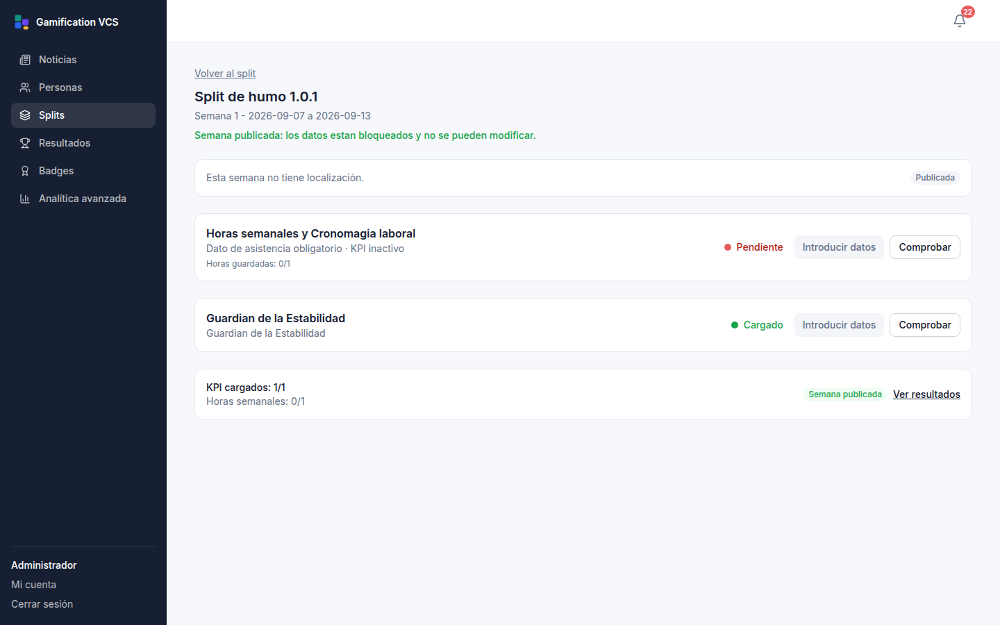
*Figura 16. Panel de KPI de una semana ya publicada.*

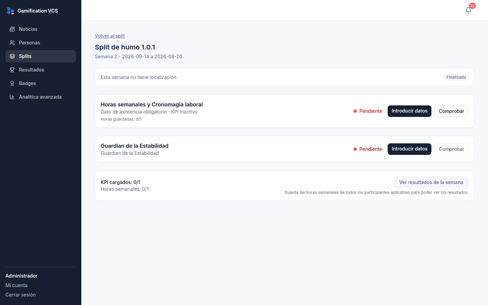
*Figura 17. Panel de KPI de la semana siguiente, todavía pendiente.*

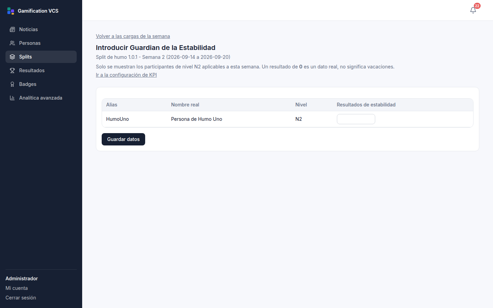
*Figura 18. Formulario de introducción manual de Guardián de la Estabilidad.*

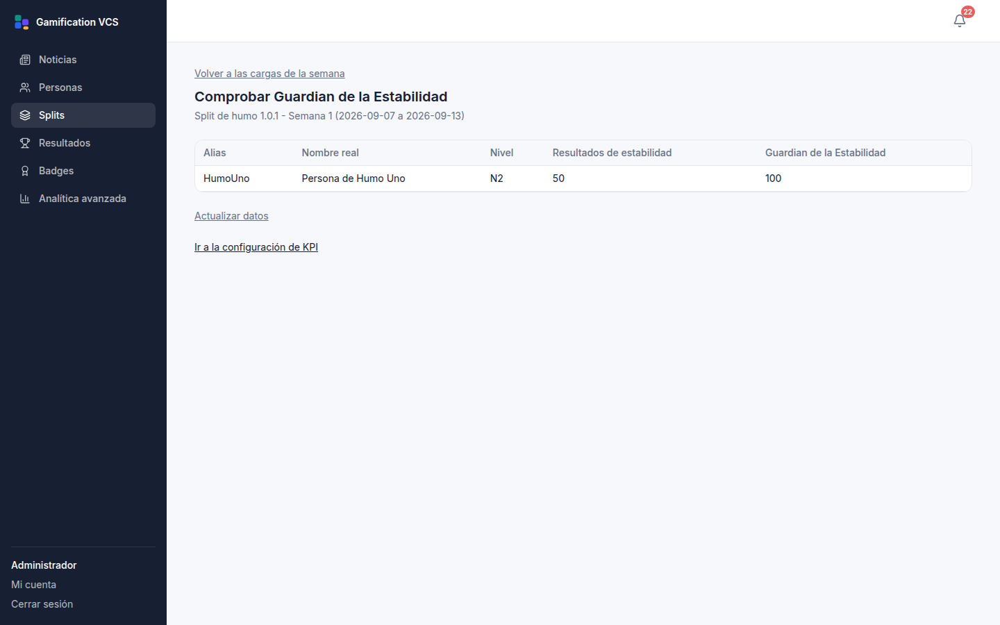
*Figura 19. Comprobación de Guardián de la Estabilidad de una semana publicada.*

### 8.5. Resultados y clasificaciones

- **Objetivo**: exponer, de forma auditable y coherente con lo publicado, el rendimiento semanal y acumulado de cada persona y del split en conjunto.
- **Usuarios**: `ADMIN` (cualquier persona, clasificación detallada) y `PARTICIPANT` (su propio detalle, clasificación limitada por alias).
- **Pantallas/rutas**: `/splits/[id]/weeks/[weekId]/resultados` (previsualización/publicación de una semana — figura 20); `/splits/[id]/clasificacion` (clasificación individual detallada, filtrable por semana/KPI — figura 13); `/splits/[id]/clasificacion-facciones`; `/splits/[id]/presentacion-resultados` (modo proyección, solo lectura — figuras 21/21b); `/resultados` (vista individual, pestañas "Por split"/"Histórico general", selector de persona para `ADMIN` — figuras 22, 23, 23b, 23c, 31, 32).
- **Métricas auditables** (qué mide, población, periodo, cálculo real):

| Métrica | Qué mide | Población | Periodo | Cálculo |
|---|---|---|---|---|
| Resultado semanal vs. por Split vs. histórico individual | Puntos y posición de una persona | La propia persona (o cualquiera, si `ADMIN`) | Una semana / todas las semanas publicadas de un split / todas las semanas de todos los splits | Suma de `PublishedKpiResult.finalPoints` por semana; agregados por split o por periodo de calendario en el histórico |
| Clasificación general del split | Ranking acumulado de participantes | Todos los participantes del split | Todas las semanas publicadas | Suma de `positionPoints` (criterio principal) y de `totalKpiPoints` (desempate secundario), ranking de competición (`rankByComparator`: empate exacto ⇒ misma posición, salto en la siguiente) |
| Puntos por posición | Puntos otorgados por el puesto semanal | Participantes con resultado esa semana | Una semana | Lectura directa de `SplitPositionPointRule` según la posición obtenida ese ranking semanal |
| Clasificación de facciones (semanal/acumulada) | Ranking entre facciones | Facciones del split (si existen) | Una semana / acumulado | Suma de los **tres mejores** `positionPoints` de cada facción esa semana (nunca una media); desempate por el vector completo de aportaciones ordenado de mayor a menor |
| Selector Con/Sin gamificación | Comparación entre el resultado oficial y el rendimiento KPI real | La persona seleccionada | Igual que la vista activa | "Con": `finalPoints` oficial (incluye bonus de profesión + localización + objetos). "Sin": `basePointsBeforeProfession` (fallback a `finalPoints` en publicaciones anteriores a `0.8.0`). Puramente analítico: nunca altera posición oficial, puntos por posición, facciones ni créditos (ver figura 23b, que mantiene exactamente la misma posición y suma porque este split de ejemplo no tiene profesión/localización/objetos activos) |
| Presentar resultados | Proyección de la clasificación de la última semana publicada | Todo el split | Última semana publicada | Lectura pura sobre `computeSplitClassification`/`computeFactionClassification`; no persiste estado ni genera noticias |

- **Validaciones/casos límite**: un empate exacto en puntos por posición otorga la misma posición y los mismos puntos a los empatados. Un split sin publicaciones muestra "Selecciona una persona para consultar sus resultados" o "Todavía no hay ninguna clasificación de facciones publicada" (figura 9) en vez de una tabla vacía.
- **Figuras**: 13, 14, 20, 21, 21b, 22, 23, 23b, 23c, 31, 32.

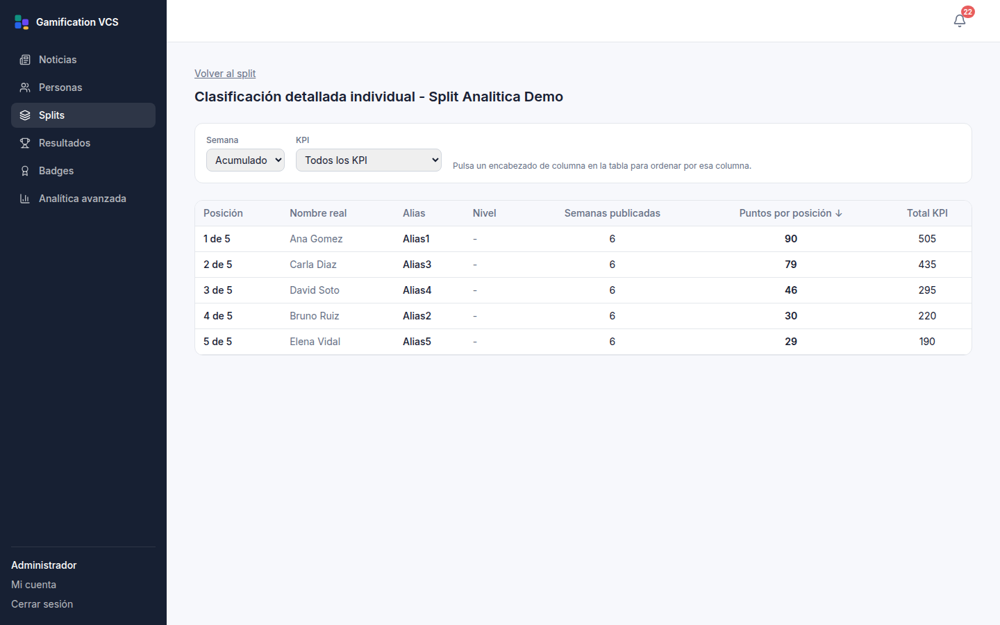
*Figura 13. Clasificación general individual detallada, filtrable por semana y KPI.*

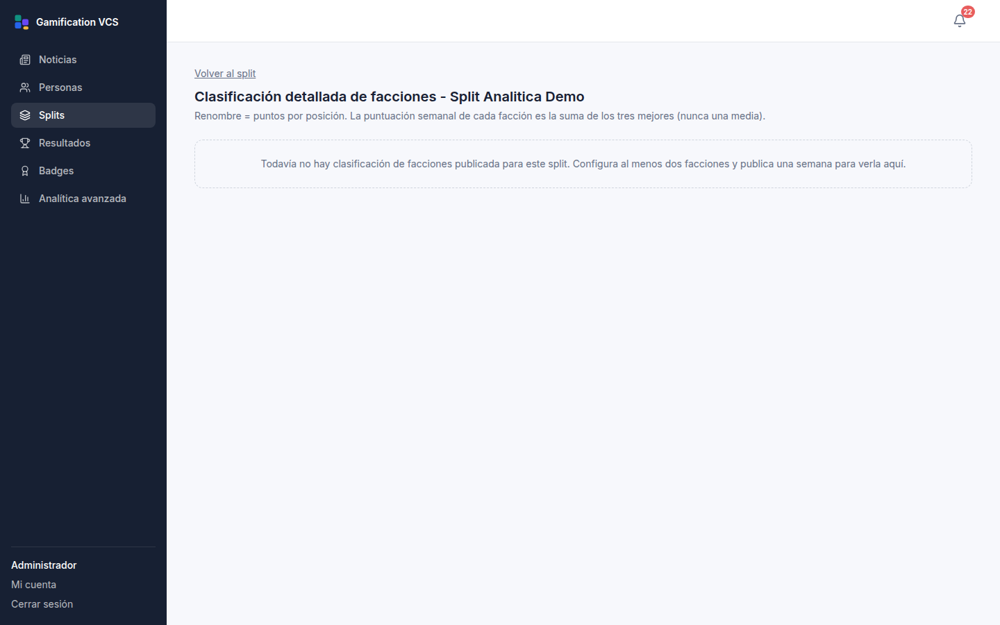
*Figura 14. Clasificación de facciones detallada (split sin facciones configuradas).*

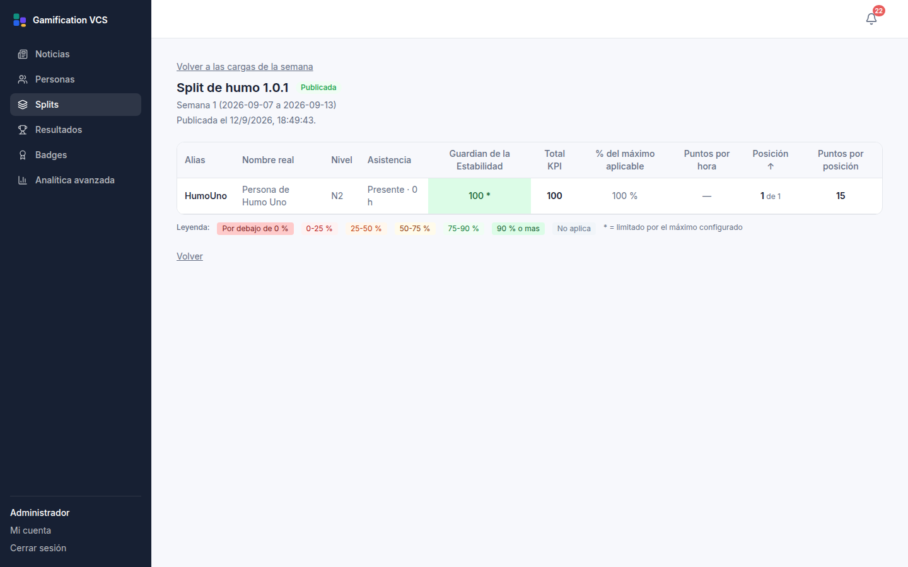
*Figura 20. Resultados de una semana publicada: puntos, asistencia y puntos por posición.*

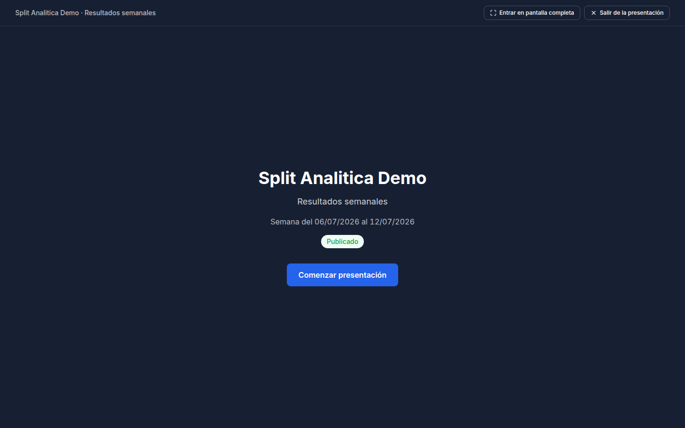
*Figura 21. «Presentar resultados»: pantalla inicial del modo proyección.*

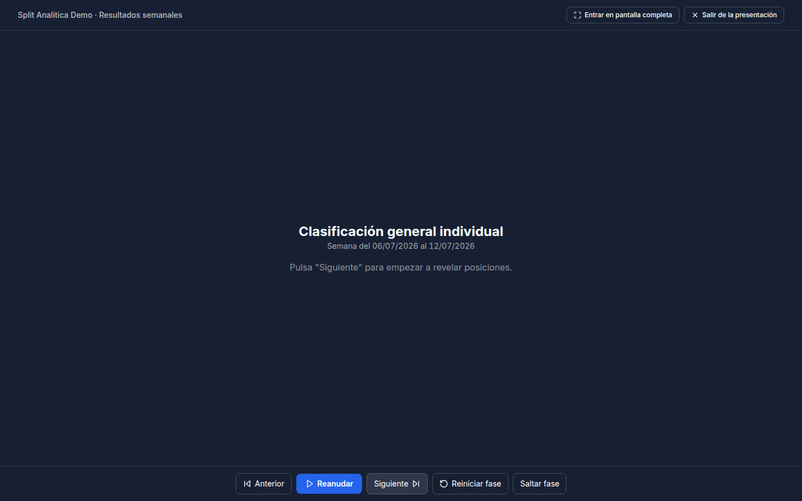
*Figura 21b. «Presentar resultados»: transición entre fases de revelado.*

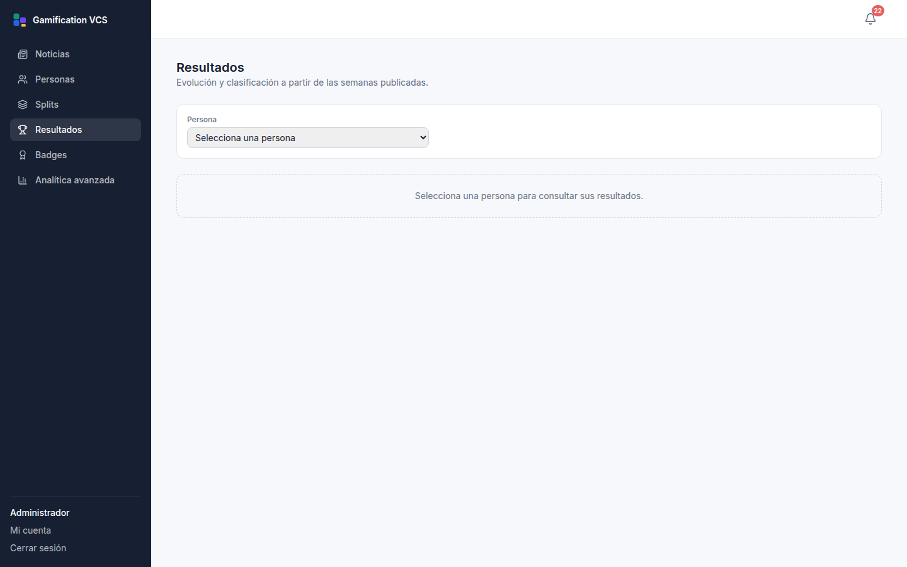
*Figura 22. «Resultados»: selector de persona sin selección (administrador).*

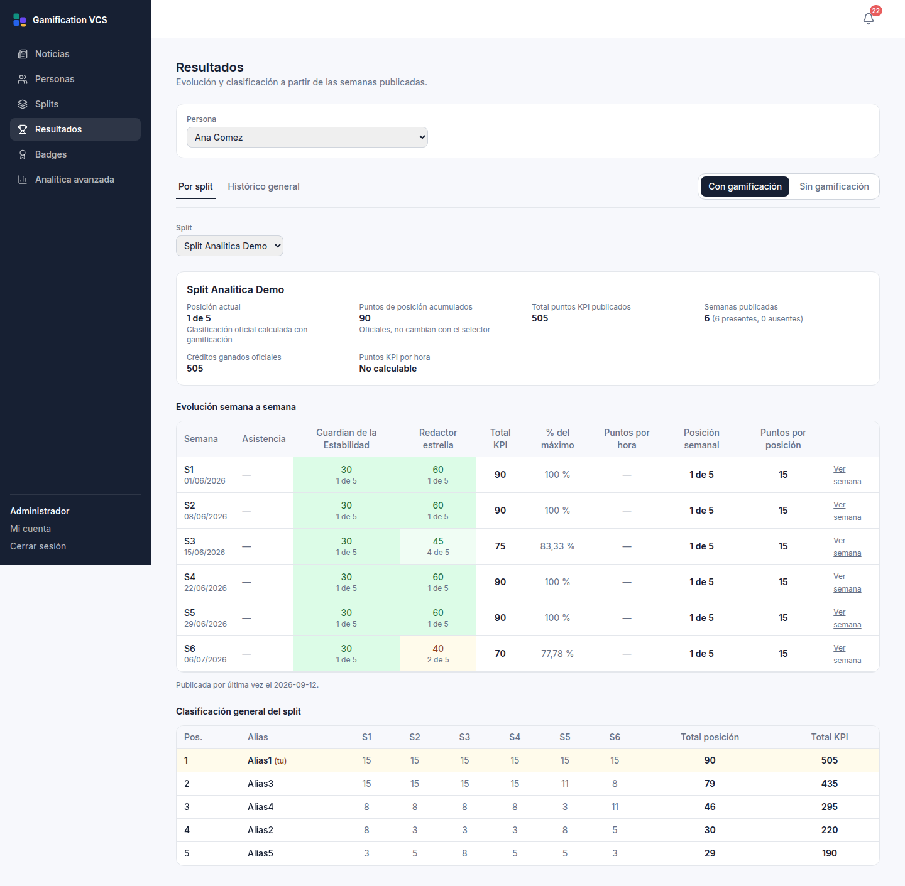
*Figura 23. «Resultados» de una persona concreta, con gamificación.*

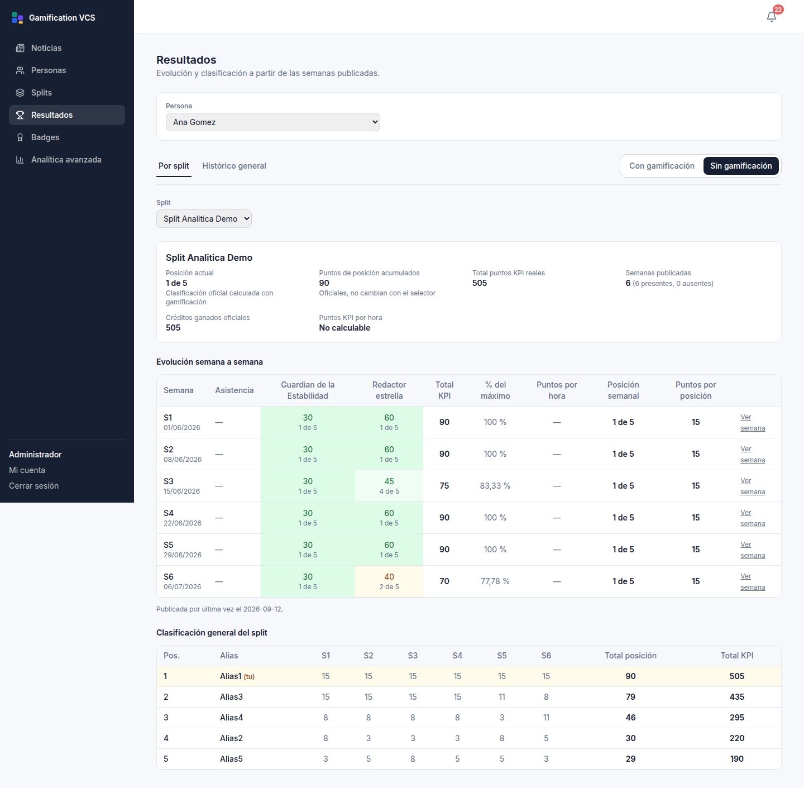
*Figura 23b. La misma vista en modo «Sin gamificación».*

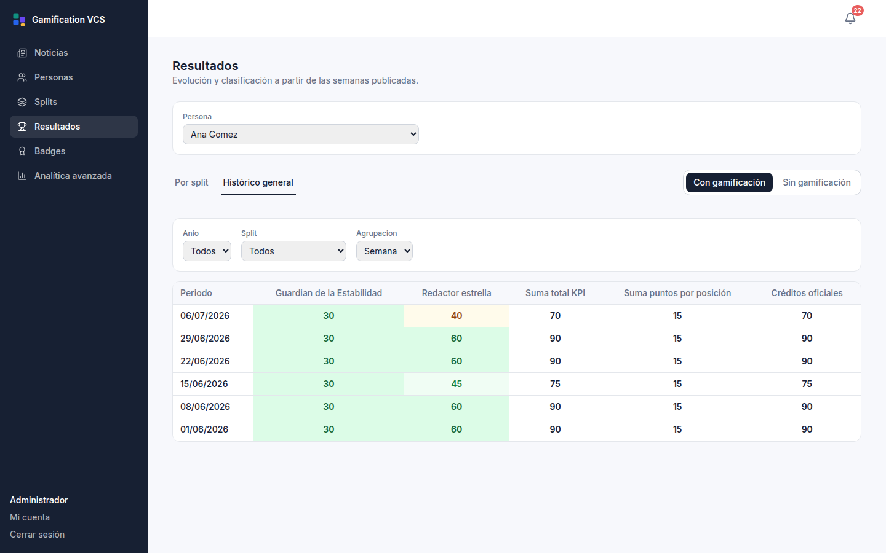
*Figura 23c. «Histórico general» de una persona (administrador).*

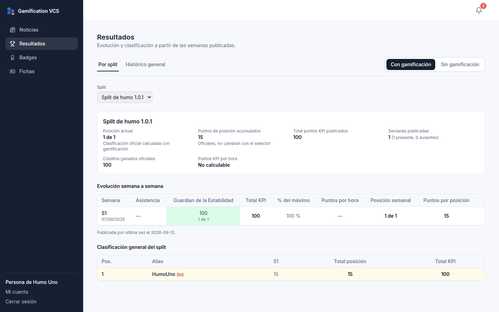
*Figura 31. «Resultados» propios del participante, por split.*

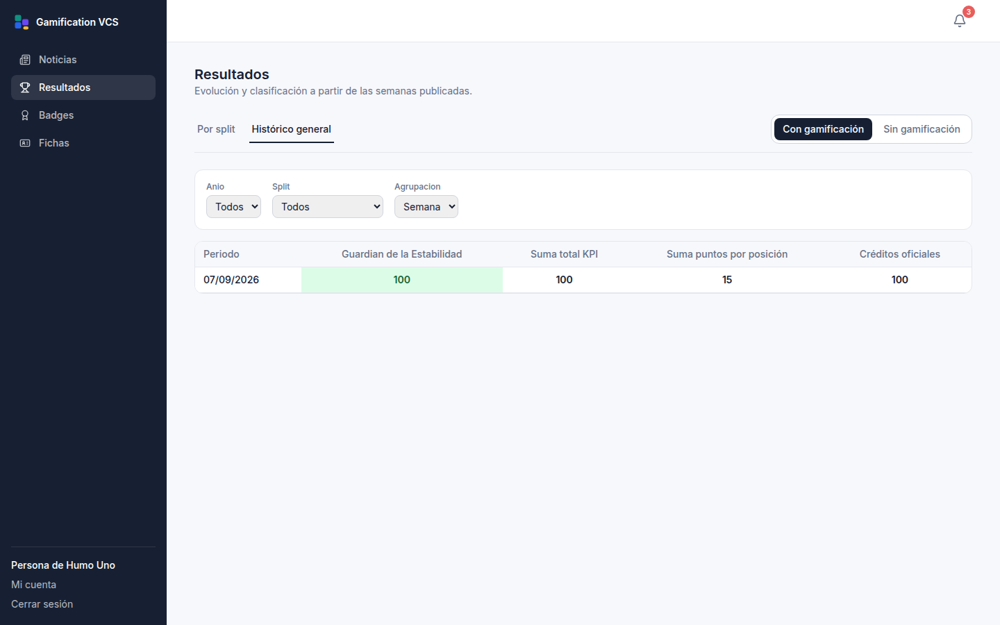
*Figura 32. «Histórico general» propio del participante.*

### 8.6. Profesiones y localizaciones

- **Objetivo**: dos capas de juego opcionales que potencian el resultado de KPI concretos, de forma independiente entre sí y respecto al resultado base.
- **Usuarios**: `ADMIN` (definición y asignación de profesión; definición de localización); `PARTICIPANT` (elección de su propia profesión, mientras no esté bloqueada; consulta de su localización activa en su ficha).
- **Pantallas/rutas**: sección "Profesiones del split" en `/splits/[id]` (figura 6, split en borrador); `/splits/[id]/weeks/[weekId]/localizacion`; tarjeta "Localización activa esta semana" en `/fichas/[splitParticipantId]`.
- **Datos — Profesión**: nombre, niveles disponibles (N0/N1/N2), exactamente dos KPI distintos del catálogo activo, bonus fijo `+20 %`.
- **Datos — Localización**: nombre, un único KPI activo potenciado, bonus del conjunto cerrado `10/20/30/40/50 %`.
- **Reglas de interfaz vs. de cálculo**:
  - Profesión: editable/asignable solo antes de la primera publicación del split; tras ella, bloqueada para administrador y participante.
  - Localización: editable solo antes de `startDate` de esa semana concreta; bloqueada desde el primer día de la semana y siempre en una semana publicada.
  - Cálculo (ambas): se aplican únicamente sobre un resultado `COMPUTED` estrictamente positivo, tras el máximo base del KPI, nunca a `VAC`/`AVISO`/`No aplica`/cero/negativos. El máximo base no se vuelve a aplicar después del bonus.
  - **No encadenamiento**: ambos bonus se calculan sobre el mismo `basePointsBeforeProfession`/`baseFinalPoints` y se suman una sola vez junto con el bonus de objetos; por ejemplo, `70 + 20 % profesión + 30 % localización = 105`, nunca `109,20` (verificado en `src/domain/profession-bonus.ts` y `src/domain/location-bonus.ts`, que reciben siempre el mismo `basePoints`).
- **Snapshot**: una semana publicada congela nombre/KPI/porcentaje de cada bonus en `PublishedParticipantWeeklyResult`/`PublishedKpiResult`; las vistas históricas nunca recalculan con la configuración viva.
- **Estados vacíos**: "Las profesiones son opcionales: si no creas ninguna, este split funciona exactamente igual que antes, sin selectores ni bonus." / "Este split no utiliza profesiones" (figuras 6 y 34).
- **Figuras**: 6, 10, 12, 34.

*Figura 06. Detalle de un split en borrador: facciones, profesiones, KPI y puntos por posición sin configurar.*

*Figura 10. KPI inactivos y tabla de puntos por posición semanal, bloqueada tras la primera publicación.*

*Figura 12. Bloqueo de facciones/profesiones tras publicar y resumen de «Economía y mercado».*

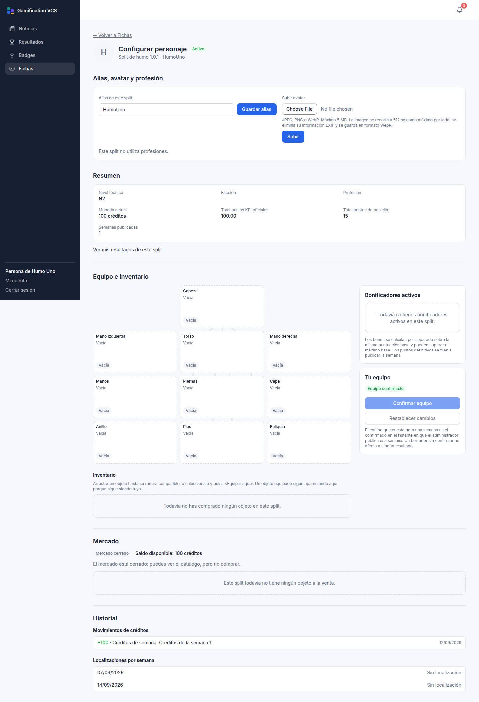
*Figura 34. Ficha — «Configurar personaje»: alias, avatar, equipo, mercado e historial.*

### 8.7. Economía, mercado y equipamiento

- **Objetivo**: tercera capa de juego opcional — un monedero de créditos por participante, un mercado administrable de objetos y un tablero de equipo visual con bonus sobre KPI.
- **Usuarios**: `ADMIN` (mercado, ranuras, catálogo); `PARTICIPANT` (comprar, equipar/desequipar objetos propios).
- **Pantallas/rutas**: `/splits/[id]/economia` (editor visual de ranuras y catálogo — figura 15); resumen "Economía y mercado" en `/splits/[id]` (figura 12); `/fichas/[splitParticipantId]` ("Configurar personaje": resumen, tablero de equipo, inventario, mercado, historial — figura 34).
- **Reglas de interfaz**:
  - Catálogo cerrado de diez posiciones visuales de ranura (Cabeza, Mano izquierda, Torso, Mano derecha, Manos, Piernas, Capa, Anillo/Artefacto, Pies, Reliquia); el administrador decide cuáles activa y cómo las nombra. Renombrar o ubicar una ranura nunca rompe objetos, compras, inventario, equipo ni publicaciones.
  - Ranuras y catálogo solo se administran con el **mercado cerrado**.
  - El equipo se confirma siempre como conjunto completo ("Confirmar equipo"), nunca equipar/desequipar uno a uno de forma inmediata; un borrador sin confirmar nunca afecta cálculos ni publicaciones.
- **Reglas de cálculo**:
  - `creditsEarned = max(0, floor(totalKpiPoints))` por semana publicada; `CreditLedgerEntry` es la única fuente de verdad del saldo (suma de movimientos, nunca un campo materializado).
  - Cada objeto afecta a un único KPI activo y pertenece a una única ranura, con bonus del conjunto cerrado `10/20/30/40/50 %`; inmutable tras la primera compra salvo su imagen.
  - El bonus de objetos es independiente y no encadenado con profesión/localización (misma base, suma aritmética); varios objetos sobre el **mismo** KPI en **ranuras distintas** se acumulan de forma aditiva.
  - El equipo que cuenta para una semana es el confirmado en el instante exacto de publicar (`publishWeek` relee el equipo dentro de su propia transacción).
  - Mercado cerrado bloquea nuevas compras, pero nunca impide equipar/desequipar objetos ya propiedad del participante.
- **Estados vacíos observados en los datos de demostración**: el split "Split de humo 1.0.1" tiene diez ranuras activas pero ningún objeto en el catálogo (figura 15: "Todavía no hay ningún objeto en el catálogo", mercado cerrado con el aviso "Crea al menos un objeto disponible para comprar antes de abrir el mercado"); el participante de ejemplo tiene saldo (100 créditos, generados por la única semana publicada) pero inventario vacío (figura 34).
- **Figuras**: 12, 15, 34.

*Figura 12. Bloqueo de facciones/profesiones tras publicar y resumen de «Economía y mercado».*

*Figura 15. Editor de ranuras de equipo y catálogo de objetos, con mercado cerrado.*

*Figura 34. Ficha — «Configurar personaje»: alias, avatar, equipo, mercado e historial.*

### 8.8. Badges y vitrina

- **Objetivo**: medallas permanentes de una persona por ganar un split (MVP), pertenecer a la facción ganadora (MVP Team) o liderar una categoría KPI, más la restauración del histórico real de los 9 splits anteriores a esta aplicación.
- **Usuarios**: `ADMIN` y `PARTICIPANT` (clasificación general y vitrina propia); solo `ADMIN` para la administración histórica.
- **Pantallas/rutas**: `/badges` (pestañas "Clasificación general"/"Mi vitrina" — figuras 25 y 35); `/badges/administracion` (solo `ADMIN`, importación y vinculación del histórico — figura 26).
- **Catálogo cerrado de 14 categorías** (`src/domain/badges/badge-catalog.ts`): las diez categorías KPI reutilizan el `KpiCode` correspondiente (para que un KPI nuevo derive su badge sin migración dedicada), dos categorías históricas sin KPI activo (Travesía del Padawan, Guardián del conocimiento), MVP y MVP Team. No existe ningún CRUD de administración que permita crear o borrar categorías.
- **Reglas de concesión**: únicamente al finalizar un split completo, dentro de su misma transacción. MVP = rango 1 de la clasificación general individual; MVP Team = pertenencia **viva** (releída en el instante de finalizar) a la facción en rango 1 de la clasificación acumulada de facciones; badge KPI = rango 1 de la clasificación acumulada de ese KPI activo. Las tres reglas reutilizan siempre `computeSplitClassification`/`computeFactionClassification`/`computeSplitKpiClassification`, con el mismo criterio de empate que la noticia final (un empate real concede el badge a todos los empatados en rango 1). Idempotente por clave (`upsert`); una concesión confirmada no se edita ni se borra desde la interfaz.
- **Histórico `legacy-badges-v1`**: 127 concesiones de 18 personas en 9 splits anteriores a esta aplicación, versionadas en el repositorio (`src/domain/badges/legacy-badges-v1.ts`); se importa con un comando explícito o desde `/badges/administracion`, nunca como backfill silencioso. Los 18 "destinatarios históricos" (`BadgeHistoricalRecipient`) se vinculan a una `Person` real solo por coincidencia inequívoca de nombre normalizado (nunca eligiendo entre varias).
- **Observado en los datos de demostración**: el histórico ya está importado (18 destinatarios, 127 concesiones, figura 26), pero **ninguno** está todavía vinculado a una persona real ("Pendiente de vincular" en los 18); ningún split de la base de datos ha sido finalizado todavía, así que la clasificación general y "Mi vitrina" de las personas de demostración están vacías (figuras 25 y 35: "Todavía no se ha concedido ningún badge").
- **Figuras**: 25, 26, 35.

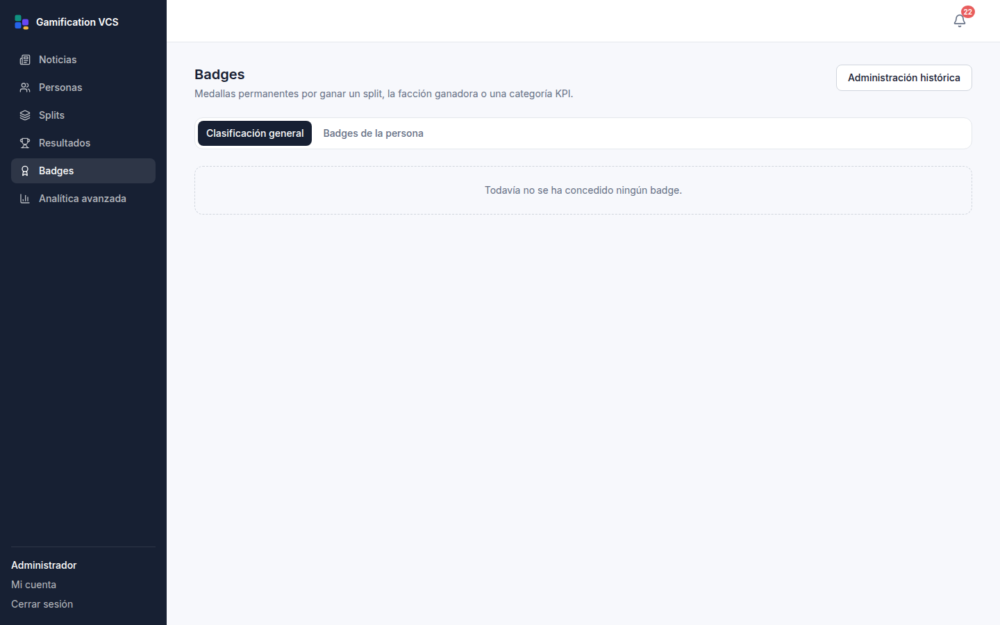
*Figura 25. Clasificación general de Badges (estado vacío: ningún split finalizado).*

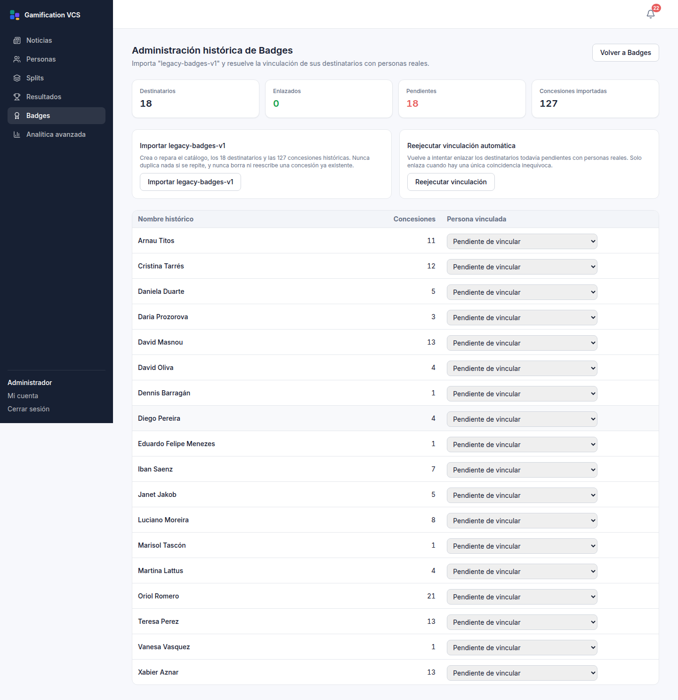
*Figura 26. Administración histórica de Badges: histórico «legacy-badges-v1» importado.*

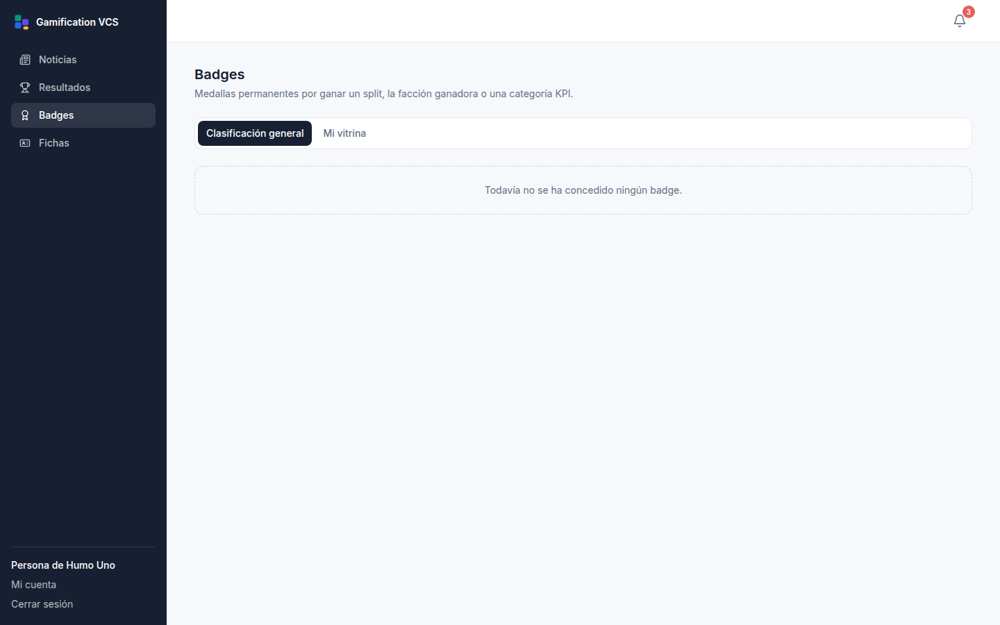
*Figura 35. «Mi vitrina» del participante (estado vacío: ningún split finalizado).*

### 8.9. Analítica avanzada

- **Objetivo**: comprensión del rendimiento del equipo a lo largo del tiempo para el responsable del área — nunca una segunda clasificación del juego: no calcula posiciones, puntos por posición ni facciones, y lee exclusivamente semanas ya publicadas.
- **Usuarios**: exclusivo de `ADMIN` (protegido en `src/middleware.ts` y `requireAdminSession()`; un `PARTICIPANT` no ve el enlace ni puede entrar por URL).
- **Pantallas/rutas**: `/analitica` (seis bloques por pestaña — figuras 27, 27b, 27c); `/analitica/personas/[personId]` (detalle de una persona con enlace a la publicación original de cada semana — figura 28).
- **Filtros compartidos** (persistidos en la URL): splits (multiselección), nivel (N0/N1/N2), intervalo de fechas, agrupación (semana/mes/año), modo (con/sin gamificación), medida (`% del máximo` / `Puntos KPI` / `Puntos por hora`), comparación (semana anterior / media del periodo).
- **Los seis bloques**, cada uno con periodo, población y exclusiones verificables:

| Bloque | Pregunta | Población | Exclusiones |
|---|---|---|---|
| Visión general | ¿Cómo está funcionando el equipo? | Personas con ≥1 semana presente en el periodo | Semanas `ABSENT` o sin dato de asistencia (`UNKNOWN_LEGACY`) |
| Rendimiento por KPI | ¿Qué KPI evolucionan mejor o peor? | Observaciones `COMPUTED` de cada KPI | Igual que arriba; agrupado por `kpiCode`, nunca por nombre visible |
| Evolución del equipo | ¿Cómo cambian los resultados en el tiempo? | Media simple del equipo por periodo | Igual que arriba |
| Distribución y consistencia | ¿La media representa al conjunto? | Igual que Visión general | Igual que arriba; mediana/cuartiles por interpolación lineal |
| Análisis por persona | ¿Cómo evoluciona esta persona frente a su nivel histórico? | Una persona (`personId`, nunca alias ni facción) | Igual que arriba |
| Impacto de la gamificación | ¿Cuántos puntos añade el juego? | Semanas con snapshot de bonus | Igual que arriba |

- **Regla de asistencia objetiva (`1.1.1`)**: una observación `ABSENT` se excluye de **todas** las estadísticas de rendimiento, en cualquier medida y modo, sin ajuste manual. Una publicación anterior a `1.1.1` (`attendanceStatus = null`) se trata como un tercer estado en memoria, `UNKNOWN_LEGACY`, también excluido — nunca reinterpretado como presente ni ausente.
- **Observado en los datos de demostración**: todas las publicaciones existentes en la base de datos (31 filas de `PublishedParticipantWeeklyResult`, en los dos splits activos) tienen `attendanceStatus = null` porque fueron publicadas antes de que el bloque de asistencia fuera obligatorio. En consecuencia, los cinco primeros bloques muestran de forma legítima "0 de N personas analizables" y "Sin datos suficientes" (figuras 27, 27b, 27c): es el comportamiento correcto del sistema ante datos `UNKNOWN_LEGACY`, no un fallo de la pantalla. El bloque "Análisis por persona" sigue mostrando, no obstante, el detalle semanal con enlace a la publicación original y el desglose base/bonus por KPI (figura 28), que no depende de la asistencia.
- **Figuras**: 27, 27b, 27c, 28.

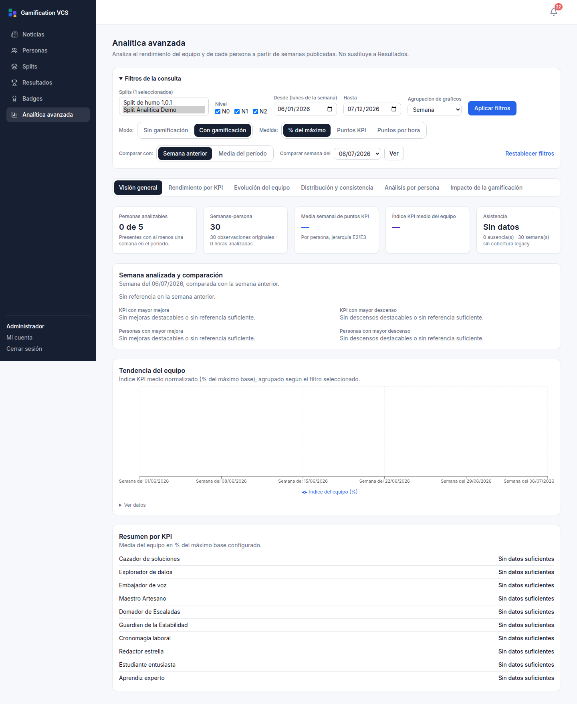
*Figura 27. Analítica avanzada: visión general, con aviso de datos de asistencia insuficientes.*

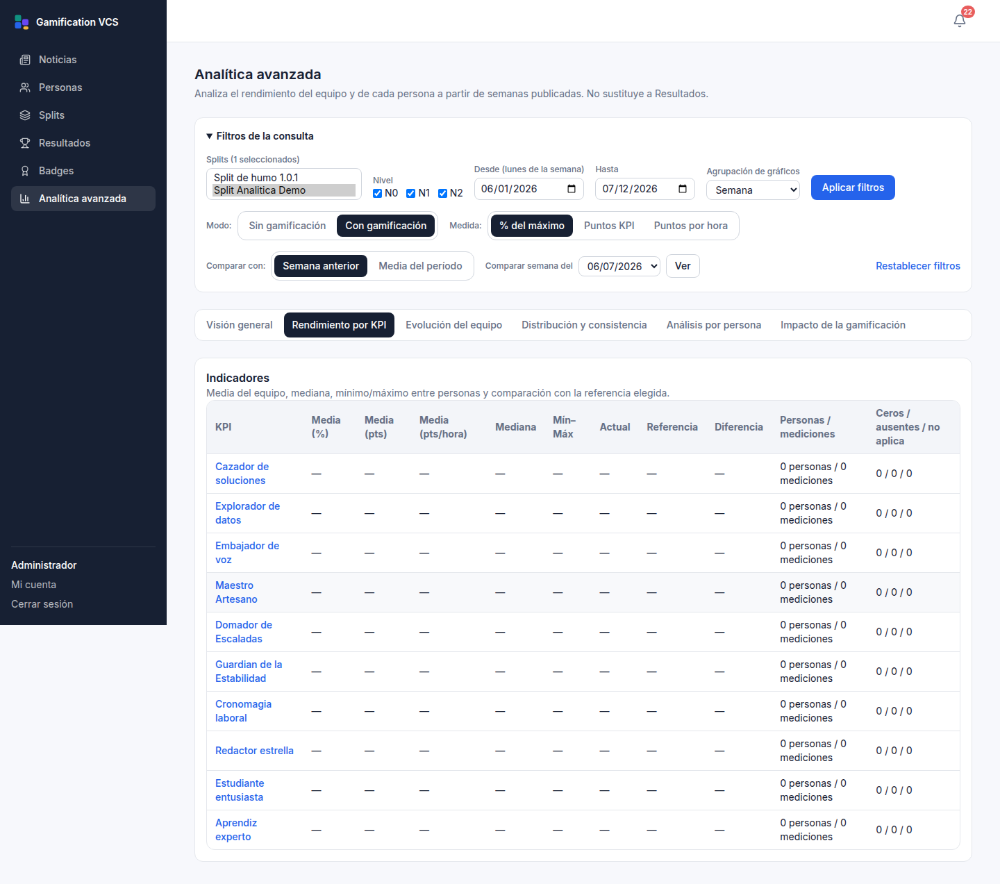
*Figura 27b. Analítica avanzada: rendimiento por KPI.*

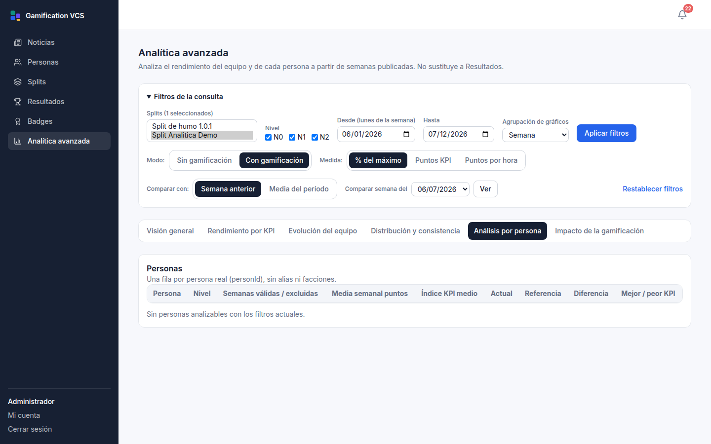
*Figura 27c. Analítica avanzada: análisis por persona (listado).*

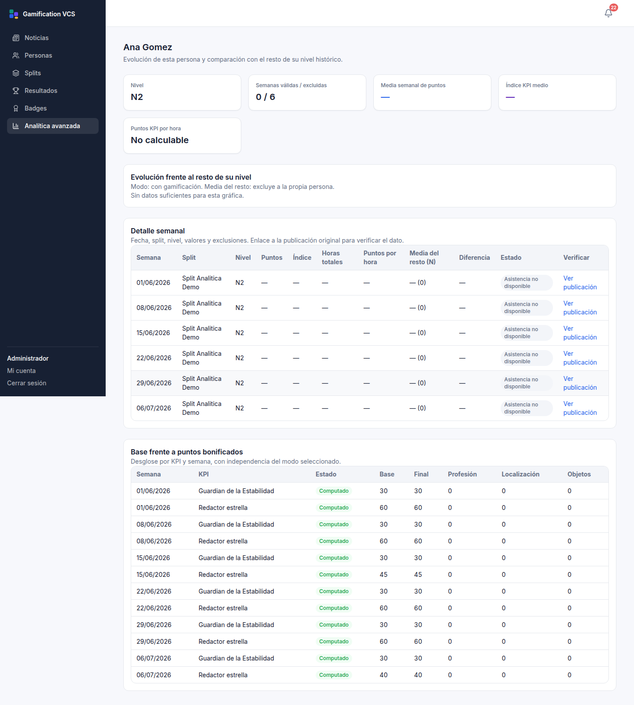
*Figura 28. Analítica avanzada: detalle de una persona, con enlace a cada publicación.*

---

## 9. Reglas transversales

| Regla | Módulo afectado | Evidencia |
|---|---|---|
| Una semana publicada es inmutable; ninguna carga/configuración de esa semana vuelve a ser editable | 8.4, 8.5, 7.3 | `WeekPublication` sin ninguna acción de reversión; figuras 16/19 muestran "Comprobar" de solo lectura |
| KPI y puntos por posición se bloquean en cuanto el split tiene una semana publicada | 8.3, 8.4 | Aviso "La configuración quedó bloqueada al publicar la primera semana del split" (figura 10) |
| Profesiones y facciones se bloquean desde la primera publicación; localizaciones desde el inicio de cada semana | 8.6 | Aviso "Este split ya tiene semanas publicadas: las profesiones y sus asignaciones quedaron bloqueadas..." (figura 12) |
| Orden fijo de cálculo de bonus: fórmula del KPI → máximo base → bonus (profesión + localización + objetos, sin encadenar) | 8.4, 8.6, 8.7 | `src/domain/profession-bonus.ts`, `location-bonus.ts`, `equipment-bonus.ts`: los tres reciben el mismo `basePoints` |
| Oficial ("Con gamificación") vs. real ("Sin gamificación") | 8.5 | `src/domain/gamification-view.ts`: selector puramente analítico, nunca reescribe publicaciones |
| `VAC`/`AVISO` se muestra como `0` numérico; `No aplica` siempre diferenciado | 8.4 | `resolveGamificationDisplayPoints` en `src/domain/gamification-view.ts` |
| Fechas de negocio siempre en UTC como fechas de calendario (nunca hora local) | 7, 8.3, 8.6 | `src/lib/dates.ts`; comprobaciones `CHECK` en `SplitWeek` (`startDate` lunes, `endDate` domingo) |
| Trazabilidad: toda vista histórica enlaza o se basa en la publicación original, nunca en la configuración viva | 8.5, 8.9 | "Ver publicación" en el detalle por persona de analítica (figura 28); snapshots `*Snapshot` en `PublishedParticipantWeeklyResult` |
| Inmutabilidad tras la primera compra de un objeto (salvo su imagen) | 8.7 | `docs/ECONOMY_INVENTORY_AND_EQUIPMENT.md`, sección 22 |
| `CLOSED` es un estado terminal único, sin reapertura | 7.2, 8.3 | `finalize-split.service.ts` es la única operación que escribe `CLOSED` |

---

## 10. Validaciones, mensajes y casos límite

| Escenario | Comportamiento / mensaje observado |
|---|---|
| Configuración incompleta para abrir el mercado | "No se puede abrir el mercado todavía: Crea al menos un objeto disponible para comprar antes de abrir el mercado." (figura 15) |
| Split sin facciones suficientes para activarse | "Todavía no hay ninguna facción configurada. Crea al menos dos para poder activar este split." (figura 6) |
| KPI inactivo | No aparece en las pantallas de carga/introducción ni en los selectores de localización/objeto; su columna no se muestra en resultados |
| Campo vacío en Redactor estrella / Estudiante entusiasta / Aprendiz experto | Se guarda y calcula como `0` sin pedir el campo como obligatorio |
| Campo vacío en Guardián de la Estabilidad / Cronomagia laboral | Se exige el campo (validación "es obligatorio") |
| Aprendiz experto con valor igual al objetivo configurado | Aceptado (comparación inclusiva); solo se rechaza al superarlo |
| Ausencia de fila de Escalados sin carga confirmada todavía | "Sin dato de Escalados" (nunca se infiere `0`) |
| Ausencia de fila de Escalados con carga confirmada y con Productividad | `0 (inferido)` en Comprobar Domador de Escaladas, con ayuda accesible, sin contar en `n AVISO` |
| Edición bloqueada tras publicación | La pantalla de carga/introducción deja de mostrar el formulario; solo queda disponible "Comprobar" |
| Mercado cerrado | Se puede ver el catálogo y equipar objetos ya propios; no se puede comprar ("El mercado está cerrado: puedes ver el catálogo, pero no comprar.", figura 34) |
| Objeto inválido (KPI inactivo, precio no entero/cero, porcentaje fuera del conjunto cerrado) | Rechazado con mensaje de validación específico (verificado en `src/server/validation`, no reproducido con captura por no forzar un error de formulario) |
| Incorporación tardía de un participante tras la primera publicación | El alta exige elegir profesión en el propio formulario si el split las usa |
| Empate en la clasificación general | Misma posición y mismos puntos por posición para los empatados (ranking de competición, ver `src/domain/ranking.ts`) |
| Usuario sin permiso accede a una ruta de administración | Redirección silenciosa a `/noticias` (participante) o a `/resultados` (en acciones protegidas por `requireAdminSession()`), sin mostrar la pantalla ni un error explícito |
| Cuenta sin persona vinculada (`ADMIN`) en `/fichas` o `/resultados` | "Tu cuenta no está vinculada a ninguna persona. Contacta con un administrador." (figura 24) |
| Analítica avanzada sin datos de asistencia en las publicaciones existentes | "0 de N personas analizables", "Sin datos suficientes" en vez de un cálculo silenciosamente incorrecto (figuras 27, 28) |

---

## 11. Seguridad y datos tratados

- **Datos personales visibles**: nombre completo y correo de `Person`/`User` (visibles para `ADMIN` en Personas y en el detalle de resultados); un participante solo ve su propio nombre y nunca el de otro en vistas limitadas (clasificación por alias). Avatares e imágenes de objeto/facción se procesan siempre en servidor (`sharp`, formato validado por contenido real, no por extensión) y se sirven por una ruta autenticada, nunca desde `public/` ni en base64.
- **Separación de permisos**: doble capa verificada (middleware por ruta + `requireSession()`/`requireAdminSession()` dentro de cada página/acción); ninguna pantalla ni Server Action acepta un `personId` del navegador para decidir qué ve o edita un participante — siempre se resuelve desde la sesión `JWT`.
- **Autenticación**: local (correo + contraseña, `bcryptjs`, 12 rondas), cookies `HttpOnly`/`SameSite=Lax` (`Secure` en producción), sin recuperación de contraseña por correo ni SSO.
- **Trazabilidad desde la interfaz**: toda cifra publicada enlaza o puede verificarse contra la publicación original (por ejemplo, "Ver publicación" en analítica, figura 28); las noticias y badges guardan un snapshot del texto/nombre en el momento del evento, nunca referencian datos que puedan cambiar después.
- **Uso interno**: aplicación de uso interno del equipo de Customer Service, sin exposición pública; no se ha realizado (ni corresponde a este documento) ninguna evaluación legal de cumplimiento normativo (RGPD u otra). Los datos de demostración usados para las capturas son ficticios (`@ejemplo.com`), excepto el histórico `legacy-badges-v1`, que es una fixture versionada en el propio repositorio desde antes de esta tarea (18 nombres, 127 concesiones), no generada ni alterada por esta revisión documental.

---

## 12. Anexo de pantallas

| Figura | Pantalla | Rol | Ruta / contexto | Qué muestra |
|---|---|---|---|---|
| 01 | Inicio de sesión | Sin autenticar | `/login` | Formulario de correo y contraseña |
| 02 | Bandeja de noticias | ADMIN | `/noticias` | Listado de eventos automáticos, filtros y pestañas |
| 03 | Envío manual de noticias | ADMIN | `/noticias/administrar` | Selector de destinatarios e historial vacío |
| 04 | Personas | ADMIN | `/personas` | Alta de persona y listado con gestión de cuenta |
| 05 | Listado de Splits | ADMIN | `/splits` | Tres splits de demostración (borrador y activos) |
| 06 | Detalle de split en borrador | ADMIN | `/splits/[id]` (DRAFT) | Calendario sin cargar, facciones/profesiones vacías, KPI y puntos por posición editables |
| 07 | Resumen del split | ADMIN | `/splits/[id]` (ACTIVE) | Cabecera, calendario de semanas, botón "Finalizar split" (visible, no accionado) |
| 08 | KPI del split y participantes | ADMIN | `/splits/[id]#kpis` | Tabla de participantes y catálogo de 10 KPI con su configuración |
| 09 | Calendario y clasificación general | ADMIN | `/splits/[id]#calendario` | Seis semanas publicadas, clasificación individual, facciones vacías |
| 10 | KPI inactivos y puntos por posición | ADMIN | `/splits/[id]#kpis` | Aviso de bloqueo tras publicación, tabla de 15 posiciones |
| 11 | Clasificación general y facciones (resumen) | ADMIN | `/splits/[id]#clasificacion` | Tabla top 5 y estado vacío de facciones |
| 12 | Economía y mercado (resumen) | ADMIN | `/splits/[id]#economia` | Bloqueo de facciones/profesiones, métricas de mercado cerrado |
| 13 | Clasificación detallada individual | ADMIN | `/splits/[id]/clasificacion` | Ranking filtrable por semana/KPI |
| 14 | Clasificación de facciones (detalle) | ADMIN | `/splits/[id]/clasificacion-facciones` | Estado vacío (split sin facciones) |
| 15 | Economía: ranuras y catálogo | ADMIN | `/splits/[id]/economia` | Editor visual de 10 ranuras activas, catálogo vacío, resumen de créditos |
| 16 | Panel de KPI de una semana publicada | ADMIN | `.../weeks/[weekId]/kpis` | Un único KPI activo, estado "Publicada" |
| 17 | Panel de KPI de una semana pendiente | ADMIN | `.../weeks/[weekId]/kpis` | Misma semana siguiente, sin publicar |
| 18 | Introducir KPI manual | ADMIN | `.../kpis/estabilidad/introducir` | Formulario vacío para Guardián de la Estabilidad |
| 19 | Comprobar KPI manual | ADMIN | `.../kpis/estabilidad/comprobar` | Resultado ya calculado de una semana publicada |
| 20 | Resultados de una semana publicada | ADMIN | `.../weeks/[weekId]/resultados` | Tabla con mapa de calor, leyenda, asistencia y puntos por posición |
| 21 | Presentar resultados (pantalla inicial) | ADMIN | `/splits/[id]/presentacion-resultados` | Pantalla de inicio de la proyección |
| 21b | Presentar resultados (fase revelada) | ADMIN | `/splits/[id]/presentacion-resultados` | Transición entre fases con controles de reproducción |
| 22 | Resultados — selector vacío | ADMIN | `/resultados` | Selector de persona sin selección |
| 23 | Resultados — persona seleccionada | ADMIN | `/resultados?persona=...` | Evolución semana a semana y clasificación del split, con gamificación |
| 23b | Resultados — sin gamificación | ADMIN | `/resultados?...&gamificacion=sin` | Misma vista en modo "Sin gamificación" |
| 23c | Resultados — histórico general | ADMIN | `/resultados?vista=historico` | Agregado por semana con filtros de año/split/agrupación |
| 24 | Fichas — cuenta sin persona vinculada | ADMIN | `/fichas` | Estado vacío explícito |
| 25 | Badges — clasificación general | ADMIN | `/badges` | Estado vacío (ningún split finalizado todavía) |
| 26 | Badges — administración histórica | ADMIN | `/badges/administracion` | 18 destinatarios históricos, 127 concesiones importadas, pendientes de vincular |
| 27 | Analítica avanzada — visión general | ADMIN | `/analitica` | Filtros aplicados al split con datos y aviso de falta de asistencia |
| 27b | Analítica — rendimiento por KPI | ADMIN | `/analitica?tab=rendimiento-kpi` | Mismo aviso de datos insuficientes |
| 27c | Analítica — análisis por persona (listado) | ADMIN | `/analitica?tab=personas` | Tabla sin personas analizables |
| 28 | Analítica — detalle de una persona | ADMIN | `/analitica/personas/[personId]` | Detalle semanal con enlace a cada publicación y desglose base/bonus |
| 29 | Cambio de contraseña | ADMIN | `/cuenta/cambiar-contrasena` | Formulario de cambio de contraseña (mismo que se fuerza en el primer acceso) |
| 30 | Noticias (participante) | PARTICIPANT | `/noticias` | Bandeja propia |
| 31 | Resultados por split (participante) | PARTICIPANT | `/resultados` | Vista propia con gamificación, sin selector de persona |
| 32 | Resultados — histórico (participante) | PARTICIPANT | `/resultados?vista=historico` | Histórico general propio |
| 33 | Fichas (participante, listado) | PARTICIPANT | `/fichas` | Tarjeta del split activo con botones "Resultados del split"/"Configurar personaje" |
| 34 | Ficha — configurar personaje | PARTICIPANT | `/fichas/[splitParticipantId]` | Alias, avatar, resumen, tablero de equipo vacío, mercado cerrado, historial de créditos |
| 35 | Badges (participante) | PARTICIPANT | `/badges` | "Mi vitrina" vacía (ningún split finalizado todavía) |

Todas las figuras están guardadas en `docs/assets/diseno-funcional/` con el nombre de archivo correspondiente al número de figura (por ejemplo, figura 07 → `07-split-detalle-resumen.png`).

---

## 13. Trazabilidad y limitaciones

### 13.1. Identificación de lo documentado

- **Rama**: `main`. **Commit exacto**: `f706ecea9bd9a807238e13fd67f5c8fcb44808b3`. **Versión**: `1.2.3` (`package.json`). **Referencia de tag**: `v1.0.2-25-gf706ece` (sin etiqueta exacta sobre este commit).
- Working tree limpio en el momento de la revisión; no se ha modificado código de producto, esquema de Prisma, migraciones ni configuración de despliegue.

### 13.2. Archivos y rutas inspeccionados (muestra representativa)

- Documentación de producto: `README.md`, `CLAUDE.md`, todos los `docs/*.md` listados en el encargo (en particular `AUTHENTICATION.md`, `SPLIT_FINALIZATION.md`, `BADGES.md`, `ADVANCED_ANALYTICS.md`, `WEEKLY_ATTENDANCE_AND_HOURS.md`).
- Dominio (`src/domain/*`): `kpis/catalog.ts`, `profession-bonus.ts`, `location-bonus.ts`, `gamification-view.ts`, `credits.ts`, `ranking.ts`, `faction-ranking.ts`, `position-points.ts`, `points-per-hour.ts`, `attendance.ts`, `badges/badge-catalog.ts`.
- Servidor (`src/server/*`): estructura de `services` y `actions` (no se ha editado ninguno).
- Enrutamiento y seguridad: `src/middleware.ts`, `src/app/**` (estructura completa de rutas), `src/lib/session.ts` (lectura).
- Base de datos: `npx prisma migrate status` (18 migraciones, esquema al día), consultas de solo lectura (`psql`) sobre `gamification_vcs` para identificar qué splits/semanas/participantes/módulos tienen datos reales.

### 13.3. Pantallas comprobadas

37 capturas reales (ver sección 12), tomadas con Chromium vía Playwright contra `npm run dev` en `localhost:3000`, autenticado como `admin@ejemplo.com` y `humouno@ejemplo.com` (contraseñas de demostración fijadas únicamente para esta revisión, sobre las cuentas ficticias `@ejemplo.com` ya presentes en la base de datos, tal como autorizó el encargo). Se recorrieron: login, noticias (ambos roles), personas, splits (borrador y activo), calendario de semanas, KPI del split, carga/introducción de KPI (semana publicada y pendiente), previsualización/publicación de resultados, clasificación general y de facciones, presentación de resultados, economía/mercado/ranuras, fichas (ambos roles), badges (clasificación y vitrina, ambos roles, y administración histórica), y analítica avanzada (visión general, rendimiento por KPI, análisis por persona y detalle de una persona).

### 13.4. Recursos de imagen creados

37 archivos `.png` en `docs/assets/diseno-funcional/`, verificados en disco con las rutas relativas exactas usadas en este documento.

### 13.5. Capturas pendientes de entorno con datos de demostración

- **Objeto inválido en el catálogo** (KPI inactivo, precio no entero, porcentaje fuera del conjunto cerrado): la regla está verificada en el código de validación, pero no se ha forzado el envío de un formulario inválido solo para capturar el mensaje de error, siguiendo la instrucción de no forzar acciones que no correspondan al recorrido normal de demostración. *Captura pendiente de entorno con datos de demostración.*
- **Finalización real de un split**: el split "Split Analítica Demo" tiene sus 6 semanas publicadas y el botón "Finalizar split" visible (figura 7), pero no se ha pulsado para no finalizar irreversiblemente un split (aunque sea de demostración), conforme a la instrucción explícita de no forzar transiciones de estado irreversibles. Por tanto, el podio final, la facción ganadora, los ganadores por KPI, la concesión real de badges a una persona de demostración y la vitrina con contenido quedan documentados por código y por `docs/SPLIT_FINALIZATION.md`/`docs/BADGES.md`, pero no por captura. *Captura pendiente de entorno con datos de demostración.*
- **Objeto comprado y equipado con bonus visible**: no hay ningún `SplitStoreItem` en la base de datos de demostración, así que no hay captura real de un objeto comprado, de un bonus de objeto en una celda de resultados, ni del panel "Bonificadores activos" con contenido. *Captura pendiente de entorno con datos de demostración.*
- **Facción, profesión o localización con datos activos**: ningún split de demostración tiene facciones, profesiones ni localizaciones configuradas; las capturas de estas secciones muestran siempre su estado vacío legítimo (`Todavía no hay ninguna facción/profesión/localización configurada`). *Captura pendiente de entorno con datos de demostración.*
- **"Carga parcial" (amarillo) de Domador de Escaladas**: no hay en la base de datos de demostración una semana con exactamente uno de los dos orígenes (Escalados o Productividad) cargado para ese KPI. *Captura pendiente de entorno con datos de demostración.*

### 13.6. Limitaciones objetivas encontradas

- **Analítica avanzada sin datos de asistencia**: las 31 filas de `PublishedParticipantWeeklyResult` existentes en la base de datos de demostración tienen `attendanceStatus = null` (publicadas antes de que el bloque de horas fuera obligatorio, o insertadas directamente como datos de demostración sin pasar por el flujo de publicación con asistencia). Por diseño (`docs/ADVANCED_ANALYTICS.md`, sección 7), estas observaciones se tratan como `UNKNOWN_LEGACY` y se excluyen de las estadísticas de rendimiento; en consecuencia, los bloques "Visión general", "Rendimiento por KPI", "Evolución del equipo" y "Distribución y consistencia" muestran correctamente "sin datos suficientes" en vez de una cifra. Esto es un reflejo fiel del comportamiento del sistema, no un defecto del documento ni de la pantalla.
- **Participante `participante@ejemplo.com` sin participación**: la persona asociada a esa cuenta ("Participante Demo") no tiene ninguna fila en `SplitParticipant`; por eso las capturas de participante se tomaron con `humouno@ejemplo.com` ("Persona de Humo Uno"), que sí participa en un split activo con una semana publicada.
- **Ningún split con facciones, profesiones, localizaciones o mercado con objetos**: los dos splits activos de demostración solo tienen KPI y participantes configurados; la capa opcional de juego más allá de las ranuras de equipo (sin objetos) no tiene datos reales que mostrar, por lo que las secciones correspondientes de este documento se apoyan en código y documentación interna además de en capturas de su estado vacío.
- **Histórico de badges sin ninguna persona vinculada todavía**: los 18 destinatarios de `legacy-badges-v1` están importados pero ninguno vinculado a una `Person` real de la base de datos de demostración, así que la clasificación general y las vitrinas de badges no muestran contenido real más allá del propio histórico pendiente de vincular.
- **Servidor de desarrollo**: se mantuvo `npm run dev` ejecutándose en segundo plano (puerto 3000) durante toda la revisión, con PostgreSQL 16 nativo en `localhost:5432`; ninguna migración se ejecutó más allá del `prisma migrate status` de comprobación (ya al día).

Este documento no incluye mejoras propuestas, futuras versiones ni recomendaciones de evolución: su único objetivo es describir, de forma verificable, el estado actual de `main` en el commit indicado.
